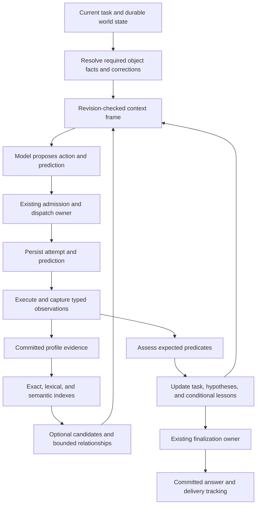

# Keith: implementation plan for a stable world and causal memory

Date: 2026-09-05

Status: concrete proposed plan. Research documents only have been changed. Implementation phases below are **not started**; their acceptance criteria are future work, not passed checks.

Companions: [research design](keith-world-and-reconstructive-memory.md) · [evidence and historical failure ledger](keith-causal-memory-evidence.md).

## Intended result

Keith should carry a dependable understanding of its world between conversations. It should retrieve relevant experience, predict meaningful consequences before acting, compare predictions with observations, and improve subsequent decisions. It should use generated explanations creatively while preserving exactly which parts are observed, asserted, inferred, or unknown.

The first convincing result is small: after learning an integration's correct endpoint, Keith handles a new, paraphrased request in a fresh conversation after restart; retrieves the corrected endpoint despite distracting memories; performs one authorized operation; survives an ambiguous acknowledgement without duplicating the effect; and later uses the experience appropriately on a different task.

This plan builds on the existing Keith daemon, memory service, session lifecycle, tool manager, and self-evolution boundaries. It does not port Neo's controllers or create a second brain. The product remains one persistent Keith with natural conversation.

## Decisions that prevent a repeat of Neo

These are working defaults selected for this plan. They can change with evidence; historical claims and experimental assumptions are distinguished in the companion ledger.

| Decision | Concrete consequence | Historical reason |
|---|---|---|
| Semantic memory is an independently configured core capability. | Chat-provider or hosting changes cannot silently remove embedding ingestion or query execution. Health proves the actual automatic activation path. | H01–H03 |
| Operational truth has exact lookup. | Required identifiers, task commitments, corrections, and unresolved attempts do not compete only in optional top-K retrieval. | H03, H06, H09 |
| A source claim retains its origin. | Assistant-generated text cannot become a runtime observation through quoting, summarization, repetition, or consolidation. | H04 |
| Generation, commitment, and delivery are separate. | A rejected candidate is never represented as delivered. A client disconnect does not erase a committed final. | H05 |
| One existing lifecycle owner makes each decision. | Prediction, retrieval, and review produce typed findings; they do not become independent terminal gates. | H05, H08 |
| Semantic similarity is candidate discovery. | It neither establishes truth nor decides whether a correction applies to the same entity/property. | H04 |
| Learning requires observed outcomes. | Exposure, invocation count, fluent reflection, and a model saying “I learned” are not improvement evidence. | H07–H09 |
| Every milestone reaches an ordinary Keith turn. | A passing package, vector endpoint, or spec status cannot substitute for runtime wiring. | H08 |

## Architecture and ownership

### A versioned world, with conditional laws

The chair analogy becomes: the same action under equivalent **relevant conditions** should have the same declared semantics. Color may be irrelevant; anchoring, mass, or applied force may change the outcome. Keith must learn which conditions matter rather than promise unconditional physical certainty.

Separate three kinds of knowledge:

1. **Enforced runtime laws:** authority, legal transitions, revision checks, budgets, operation identity, and truthful effect states. Deterministic code owns them.
2. **Adapter contracts:** what an external operation promises, what readback can establish, and whether retries are idempotent. These are versioned and have explicit limits.
3. **Learned regularities:** conditional expectations supported by episodes. These remain revisable and cannot override the first two.

Proposed `WorldVersion` identifies native schemas, outcome vocabulary, and transition semantics. A `CapabilityEpoch` identifies installed bindings, versions, and available grants. A `WorldFrame` also identifies the current object revisions and task state. Authority is rechecked at dispatch; an old frame never preserves a revoked grant.

The native contract is fixed within its version. New files, tasks, websites, and compositions of existing actions are mutable state. Installing or changing a tool binding creates a capability transition; changing native semantics requires a world-version transition. Neither is silently introduced during an admitted action. This is Keith's proposed adaptation of the [Compiled World Runtime](https://compiled-world.sites.paxeer.app/), with compatibility for its existing plugin architecture.

On a version change, invalidate stale capability assumptions, reassemble context, and reassess affected procedures. Pending effects keep the contract and operation identity under which they were dispatched. A new version cannot reset their reconciliation state or make them eligible for blind retries.

### Reuse the existing owners

| Existing area | Planned responsibility |
|---|---|
| `agent-types`, existing contract crates | Versioned IDs and values that genuinely cross boundaries; reuse existing effect, revision, and authority types. |
| `memory` | Evidence validity, typed hypotheses/relations, correction closure, required-anchor resolution, recall policy, and candidate-search trait. |
| `retrieval` | Rebuildable lexical/vector projections, index generations, freshness and ranking. Implement the memory-owned search contract from the permitted outer layer; do not make memory depend on a provider. |
| `provider-adapters` and existing credential boundary | Concrete embedding transport, request/response normalization, credential references, limits, cancellation. Confirm allowed dependency placement in phase 0. |
| `session`, `agent-loop`, `tool-core` | Durable action/prediction linkage, legal effect transitions, one dispatch decision, one finalization decision. |
| `local-runtime`, `daemon-core` | Assemble the real services; recover unfinished ingestion/assessment; build the versioned context frame. No duplicated domain rules in glue. |
| `delivery`, `ui-model` | Preserve committed and delivered distinctions; render honest projections across clients. |
| `evolution`, `task-recipe`, `skills` | Conditional experience reuse and existing reviewed procedure/recipe pathways. A lesson alone is not executable installation authority. |
| `meta-harness`, `self-evolution` | Optional later code-repair proposals and independent evaluation. Learned memory cannot modify protected policy, evaluators, or promotion rules. |

The [current source map](keith-causal-memory-evidence.md#current-keith-source-observations) documents the starting point. In particular, automatic memory activation currently reaches lexical/trigram observatory search; a separate optional vector component does not close that gap.

### One flow through the actual runtime

This diagram describes ownership and data flow, not separate agents or mandatory extra model calls.

## Record contracts

Extend existing types where possible. The following fields are requirements to map to actual schemas in phase 0, not permission to create duplicate stores.

| Record | Required information |
|---|---|
| Evidence anchor | Existing source IDs/digests, authority, sensitivity, profile, validity, and correction lineage; add explicit effective-time interval and source-root identity where missing. |
| Task/object binding | Task, canonical entity, property, current evidence revision, scope, freshness requirement, and missing/conflicting status. |
| Hypothesis | Claim, source anchor IDs, conditions, alternatives, counterevidence, generator/version, and proposed/supported/disputed/retired state. Inferential origin is permanent. |
| Relationship | Typed endpoints, observed/asserted/inferred provenance, scope, support roots, counterevidence, validity, and revision. |
| Prediction | Attempt ID, world/capability versions, action identity, preconditions, evidence references, expected predicates, observation deadlines, and uncertainty. Frozen before dispatch. |
| Assessment | One status per predicate, observation references, evaluator identity/version, assessment time, and unresolved reason. Later evidence appends an assessment revision. |
| Procedure experience | Conditions, expected results, valid adapter/world versions, supporting independent episodes, failures, applicability limits, and adoption history. |
| Retrieval manifest | Query/representation digest, source revision, index generation, candidate lanes, selected IDs/revisions, required coverage, actual context inclusion, and degraded reasons. |
| User-pattern hypothesis | Scoped interpretation, attributable user-signal roots, alternatives, counterexamples, last explicit correction, expiration/review state, and measured downstream utility. |

An observation proves what its source observed. A successful shell exit proves process completion, not a remote deposit or a published page. Likewise, a user assertion is attributable evidence without becoming a runtime-certified fact about the external world.

Store corrections against canonical entity/property identity where available. Preserve older values for historical queries but resolve the current value through its correction chain. When identity is ambiguous, expose competing candidates or perform an appropriate lookup; do not silently merge them.

Canonical truth stays in the existing owning store. Embeddings and inferred summaries are projections. Add a durable projection job or revision cursor tied to canonical commits; a crash between canonical commit and index update must replay the work. Where stores cannot share a transaction, use idempotent reconciliation by source ID and revision and document the consistency window. Never simulate a cross-store transaction with an untracked pair of writes.

## Semantic memory that cannot silently disappear

### Baseline implementation

Start with one trained text-embedding model in automatic memory activation. Keep exact lookup and lexical matching. Benchmark multiple providers before selecting the default; do not introduce several vector spaces simply because requests are inexpensive.

Use a provider-neutral embedding contract with:

- independent model/configuration and credential references from chat inference;
- explicit query versus document representation;
- model identity/revision, dimensions, distance metric, normalization, and representation version;
- bounded batch size, timeouts, cancellation, input length, and cost accounting;
- output validation for count, order/identity, dimensions, finite values, and valid nonzero vectors;
- no silent truncation: chunk or reject oversized input with a visible indexing reason.

The current `Embedder` interface only exposes dimensions and text embedding. Plan an additive migration of that interface or an owning contract, not an unannounced breaking replacement.

Initial benchmark candidate: `voyage-4-large` at its documented default dimension, using document/query modes. `voyage-4-nano` is an open-weight candidate for offline evaluation. These are starting candidates, not selected winners or commitments to install them. [Provider reference](https://docs.voyageai.com/docs/embeddings).

A trained local model can satisfy the core capability if it passes the same tests. Cloud embedding only receives content allowed by the profile's data policy; the upgrade must not silently start exporting local memories. If no permitted encoder is available, expose lexical-only operation honestly.

### Freshness and fallback

Record per projection: `source_id + source_revision + representation_version + encoder_id + index_generation`. Track ingestion backlog, failed jobs, query-encoder readiness, and last successful real retrieval probe.

| Situation | Required behavior |
|---|---|
| New anchor has not been embedded | It is immediately available through required-binding/exact lookup; optional recall includes a bounded recent-unindexed lexical lane. Report semantic coverage lag. |
| Embedding provider is down | Preserve canonical writes and retry jobs with backoff. Use available exact/lexical retrieval. Do not report semantic readiness. |
| A task requires a fact unavailable in fallback | Resolve the exact dependency through another permitted read, or report the gap. Only dependent actions wait; ordinary conversation remains usable. |
| Local hashed text features are available | Identify them as a lexical similarity baseline. They cannot satisfy the trained-semantic capability check. |
| Index is corrupt or model metadata mismatches | Quarantine the affected projection, rebuild from permitted current evidence, and continue honest fallback. |
| Chat model changes | Embedding configuration and indexes remain intact; run the memory path conformance case. |
| Embedding model changes | Build a new generation, encode both documents and queries compatibly, compare retrieval, then switch the generation pointer. Retain the prior usable generation for rollback under the retention policy. |
| A fallback uses another model | Query only its own compatible, sufficiently populated index. Never insert unrelated vectors into the current space because dimensions happen to match. |
| A record is corrected, forgotten, or access is revoked | Update exact visibility immediately and invalidate all cached/indexed views. Filter again against canonical revisions before use; rebuild/restore may not resurrect deleted content. |

Readiness has distinct states: `semantic_ready`, `semantic_lagging`, `lexical_only`, and `unavailable`. These are capability states, not blanket “stop Keith” conditions.

A deployment check must insert an attributable test anchor, retrieve it with a low-overlap paraphrase, resolve its current revision, and prove its inclusion in the next actual provider context. A connectivity probe alone is insufficient.

Include a semantic-specific case with no supplied entity ID and negligible lexical overlap. Record the contributing lane and compare the same query with the semantic lane disabled. Exact bindings must still work in that comparison, while the semantic case must demonstrate additional retrieval value. This prevents an exact-match shortcut from making a disconnected encoder look qualified.

### Multidimensional relationships

Start with two derived representations: observation meaning and structured action/precondition/outcome. Add goal/procedure and user-pattern views only after comparison. Each view maps back to the same canonical evidence IDs.

Use exact entity/property/time filters plus lexical and vector candidate retrieval, then rank fusion and bounded relationship traversal. Do not interpret vector coordinates as named causes or emotions. Do not average unrelated model scores or count one episode returned by three views as three observations.

Initial traversal bound: two hops and 200 visited nodes, with explicit coverage reporting. Correction and supersession closure for selected records is required even when optional traversal is exhausted; detect cycles and unresolved chains rather than selecting a convenient older value.

## Required knowledge and optional recollection

Build the frame in this order:

1. Current task, grants, capabilities, object revisions, pending effects, and relevant commitments.
2. Exact bindings required for the proposed task/action, including applicable corrections and current authoritative identifiers.
3. Related anchors retrieved across exact, lexical, semantic, and relationship paths.
4. Conditional procedures, counterexamples, and optional user-pattern context.
5. Optional generated reconstruction, with its own label and source links.

Required bindings are scoped to the current task and imminent action; this is not permission to pin the entire memory store. A newly discovered dependency triggers frame refresh before the dependent action.

Initial context allowance: at most 4,000 tokens for the required frame and 8,000 for optional recollection, subject to the model's remaining context and existing system constraints. These are tuning defaults. If required state cannot fit, narrow the active subtask or fetch a bounded detail view; never silently omit unresolved effects or replace their status with generated prose.

Record both selection and actual inclusion. “Retrieved” is not “shown to the model”; “shown” is not “used correctly.” The evaluation observes all three stages separately.

Current instructions outrank historical preferences. Historical facts remain evidence until corrected or shown stale; a fresh model guess is not a user correction.

## Prediction, assessment, and repeated failure

### Before and after actions

Every state-changing action carries a compact prediction plus runtime-defined completion requirements. A meaningful diagnostic experiment carries the hypothesis it tests and the observation that would distinguish alternatives. Routine reads carry lightweight observation intent; they do not require a reflective essay or another model call.

Initial predicate vocabulary:

- object exists in an identified authoritative scope;
- object revision or content digest equals the expected value;
- operation receipt matches the admitted operation identity;
- typed property equals or satisfies a bounded expected value;
- process terminated with an observed result;
- answer committed or transport acknowledgement received, explicitly distinguished.

A user-goal verifier may require several predicates. The model cannot redefine completion as an easier condition. Subjective goals can use existing review or explicit user feedback, with that evidential basis recorded.

Assessment states are `supported`, `contradicted`, `pending`, `unresolvable`, and `not_executed`. An evaluator error or timeout yields an unresolved reason, never “supported” by default. Missing observations do not prove absence. A deadline can contradict a latency prediction while the external effect remains unknown.

Predictions are persisted with admitted attempts before dispatch. If this durable write fails, do not dispatch the dependent effect. If optional reflection or memory indexing fails after an observed success, preserve the successful task and queue follow-up; it must not make a valid final disappear.

Results are assessed after meaningful actions and again at task completion. Pending external outcomes get durable bounded follow-up through existing wait/scheduler facilities. User interruption remains immediate; it stops new work without erasing effects already in flight.

### One convergence controller

Extend the existing owner with a strategy record: task, target object, intended effect, mechanism, failed preconditions, attempt IDs, and evidence roots. Literal argument edits and a new conversation do not reset it. Model-generated strategy names alone cannot authorize a reset.

An unknown consequential effect enters reconciliation immediately. A known invalid precondition is rejected before dispatch. Only otherwise admissible attempts participate in the repeated-mistake allowance.

Starting experiment settings: after three unsuccessful attempts using the same mechanism without useful evidence, require a strategy revision. Permit up to two revision rounds with at most five additional diagnostic reads/experiments in total, within existing turn/goal token, time, and cost budgets. These are initial bounds to measure, not universal constants or proof that a third attempt is always safe.

The revision output is short: failed expectation, relevant evidence, alternative explanation, and a permitted discriminating next step. Evidence may disconfirm a hypothesis; that counts as information when its scope is relevant. Merely receiving another different error string or repeating the same observation does not.

If no informative authorized action is available, give an honest incomplete answer or preserve a durable wait. Do not respawn indefinitely, strip useful tools globally, or ask the user to debug routine internal details.

### Learning and transfer

Use a ladder with distinct meanings:

1. An episode becomes attributable experience immediately.
2. A conditional lesson can be retrieved as tentative advice after one episode.
3. Broader reuse becomes eligible after at least three independent relevant episodes, including a changed-condition test and consideration of counterexamples. This is a provisional evidence minimum, not a statistical guarantee.
4. Executable recipe/skill adoption follows the existing review and authority path.
5. Harness modification follows the existing independent self-evolution path.

Keep outcome classes and applicability limits with every lesson. A contradiction can narrow or suspend a lesson immediately. No learned procedure may change authority, completion criteria, or world laws.

Reflection without weight updates has precedent in [Reflexion](https://arxiv.org/abs/2303.11366). Its role here is an experimental comparison; fluent reflection is not independent evidence.

## Reconstruction with factual anchors intact

Allow the model to generate connections such as “the two failures may share an expired-session cause.” This can help select an experiment even when the connection was never explicitly stored.

Represent each generated connection with its anchor IDs, inferential status, alternatives, and unresolved claims. A generated sequence of events is not an exact recollection. Exact quotes, dates, identifiers, tool results, and action states must come from their sources; invented specifics cannot be used as authoritative action parameters.

Reconstruction is normally ephemeral. When retained, it is a hypothesis with generator provenance, never an observation. Its embeddings index that hypothesis class. Summaries and consolidation preserve the class; referencing an assistant transcript does not turn the transcript's claim into external evidence.

Deterministic checks can establish valid source references, exact quotes, compatible versions, and prohibited authority promotion. They cannot prove arbitrary prose is entailed by its sources. Use bounded claim checks and held-out unsupported-claim evaluation; on a failed check, drop the reconstruction and retain the anchor answer.

Do not require reconstruction on every recall. Compare it with anchor-only retrieval. Disable it when it does not improve decisions.

## Importance from latent user patterns

The [Latent Relatedness paper](https://latent-relatedness.sites.paxeer.app/) motivates looking across distributed signals for a provisional underlying priority. Apply that inference to optional retention, not to authority or the definition of truth.

Use three storage classes:

- **Operational state:** active commitments, pending effects, and current bindings. Retain until their owning lifecycle resolves them; conversational retention cannot delete an obligation.
- **Protected evidence within the user's retention policy:** explicit remember requests, corrections, decisive exceptions, and source evidence supporting active lessons. Protection means priority, not permanent or undeletable storage.
- **Optional experience:** selected under a budget using estimated future usefulness.

Capture attributable signals in a bounded recent buffer so importance can emerge later. Suggested experiment defaults are seven days or 50 MiB of sanitized text, whichever comes first, restricted by existing profile policy. Do not duplicate screenshots, secrets, or whole transcripts unnecessarily. Expired evidence remains a gap.

At consolidation, group by task/entity and semantic relationship; propose at most a few competing patterns; attach distinct user-signal roots and counterexamples. An inferred preference can influence low-impact personalization tentatively after repeated independent signals. It cannot become a pinned instruction merely through repetition.

Start optional selection with an interpretable score using current-goal relevance, explicit importance, prior measured usefulness, novelty, correction/exception value, and storage cost. Keep the coefficients fixed during the first experiment and record them; do not prematurely implement a self-modifying scorer. Reserve an initial 20% of optional retention for counterexamples, rare events, and unexplained signals.

Concrete baseline for optional candidates: normalize each feature to [0,1] and use `S = 4*goal + 3*explicit_importance + 2*measured_usefulness + 2*novelty + 3*exception_value - storage_cost`. Unknown measured usefulness starts at zero, not a model-invented success estimate. Mandatory state and protected correction evidence are handled before scoring. These weights are deliberately simple experimental defaults; compare against equal-budget baselines before adopting or learning replacements.

Measure usefulness on subsequent tasks: correct fact use, fewer repeated questions, avoided repeat failures, and helpful personalization. Retrieval frequency and lack of complaint do not count as confirmed usefulness. Record when Keith's own recommendations caused an interaction, so it is not mistaken for independent user evidence.

Forgetting a signal invalidates dependent patterns and cached reconstructions. If a user rejects an inferred preference, retain only the permitted correction needed to prevent re-inferring it from remaining data; if they request deletion of the underlying data, obey the stronger deletion request. Preserve scope: professional work does not automatically imply personal preference.

## Implementation phases

Each phase has one ordinary runtime demonstration. Dependency gates apply to integration; independent design work can proceed earlier. No dates or effort estimates are claimed before phase 0 resolves ownership and migration size.

| Phase | Work package and owners | Exit evidence | Depends on |
|---|---|---|---|
| P0 — Baseline and contracts | Trace source ingestion, automatic activation, dispatch, finalization, and recovery. Map the conceptual records to existing types/stores. Define corpus, manifests, telemetry, and proposed schema changes. Owners: memory, local-runtime, session/tool owners. | A recorded existing-Keith run with versioned source map and known gaps; exact ownership for every new field; baseline scores; no duplicate authority. | None |
| P1 — Durable truth | Add missing task/object bindings, correction closure, source-class preservation, attempt/prediction persistence seam, and capability-version linkage. Integrate with existing session/delivery states. | Restart and correction cases pass through a real daemon/store; rejected candidate does not appear delivered; unknown effect remains unknown. | P0 |
| P2 — Semantic activation | Add independent encoder adapter/configuration, revisioned indexing jobs, compatible index generations, health states, and semantic candidates to the actual activation path. | Fresh-conversation paraphrase retrieves and includes the correct anchor; backlog, provider outage, model switch, deletion, and loaded-corpus cases are exercised. | P0; P1 truth contracts before acceptance |
| P3 — First complete teaching loop | Implement compact predictions, typed assessment, required-bindings preflight, and one convergence controller. Start with file revision and one disposable integration supporting operation-key readback. | Full first demonstration below passes after compaction/restart; failed verifier remains unknown; ordinary successful answers still deliver. | P1, P2 |
| P4 — Conditional lessons and relationships | Index action/outcome representations; bounded typed graph traversal; retrieve exceptions; integrate experience into existing learning/recipe pathways. | Transfer succeeds when causal conditions match and is rejected/narrowed when they change; repeated text is not independent support. | P3 |
| P5 — Labeled reconstruction | Generate bounded hypotheses from anchors, retain provenance through context/compaction, and add unsupported-claim checks. | Anchor-only versus reconstruction comparison; no promotion of invented events/identifiers; correction and forgetting invalidate dependent output. | P4 |
| P6 — Latent importance | Add bounded recent-signal capture, scoped pattern hypotheses, optional retention scoring, exploration quota, and explicit correction handling. | Chronological future-task evaluation beats or usefully complements explicit/recency/frequency baselines without losing required evidence. | P2, P4; evaluate independently of P5 |
| P7 — Qualification and staged adoption | Run the corpus through daemon, fresh sessions, scheduled wake, representative clients, upgrades, restart, and real providers. Shadow optional layers before enabling them. | Versioned evidence bundle, metric report, unresolved limitations, compatibility/rollback demonstration, and user-visible workflow proof. | Accepted earlier phases |

### First implementation slice

Once implementation is requested, begin with P0 and the P1/P2/P3 dependency chain:

1. Record the current automatic activation call path and a baseline paraphrase miss/hit. Capture source IDs and actual context inclusion, not model explanations of what it remembered.
2. Wire one trained encoder to that path with independent configuration, exact bindings, canonical revision filtering, and honest fallback.
3. Create one disposable task-bound integration record with an initial endpoint and a later explicit correction. Add 10,000 unrelated or near-matching memories.
4. Restart and request the task using different wording in a fresh conversation. Verify that the corrected endpoint is used verbatim.
5. Persist a prediction and one admitted write. A controlled service commits the effect but loses the acknowledgement.
6. Compact and restart. Require reconciliation by operation identity, recover the matching object, and observe exactly one committed effect.
7. Resolve existence separately from acknowledgement timing, retain a conditional lesson, and deliver a truthful answer.
8. Try an analogous operation with different incidental wording, then one whose adapter lacks authoritative readback. Reuse the lesson only within its supported conditions.

The controlled service is a real process with durable state and explicit fault injection at the external boundary. It is not a canned internal success collaborator. A live provider and an independently observable disposable integration are still required for packaged-runtime qualification.

## Failure corpus and acceptance matrix

All cases run against genuine orchestration and persistence. Record initial state, versions, injected fault, expected evidence, observed evidence, and result. A failure remains a failure until the owning behavior changes.

| Case | Trigger | Required observable result |
|---|---|---|
| C01 Missing encoder | Remove permitted embedding access after a successful run. | Health degrades, canonical data survives, exact lookup works; no false semantic-ready claim. |
| C02 Provider independence | Switch chat provider with embedding configuration unchanged. | Same anchor lineage and compatible memory index remain usable in automatic activation. |
| C03 Incompatible vector space | Query with the wrong model, dimensions, or representation revision. | Mismatch rejected; no contaminated search or mixed index write. |
| C04 Recent memory | Recall before background indexing completes. | Required fact resolves exactly; optional coverage reports lag. |
| C05 Crowded corpus | Required operational fact competes with 10,000 distractors. | Correct current binding reaches action; optional top-K cannot evict it. |
| C06 Plausible wrong identifier | Model proposes a guessed domain which returns a plausible page. | Known binding is checked first; the guessed result cannot establish service nonexistence. |
| C07 Correction and stale capability | Correct an endpoint; remove/replace a tool binding. | Current binding wins; stale procedure/tool assumptions trigger refresh, not invention. |
| C08 Rejected answer | Generate a final candidate rejected before commitment. | It remains a candidate and does not become delivered history or evidence that the user was answered. |
| C09 Lost acknowledgement | External write commits but response is lost; restart. | Exactly one effect on the supported adapter; unknown state persists until authoritative reconciliation. |
| C10 Process success, task failure | Command exits zero with a structured application error. | Process success and application failure remain distinct; no false completion. |
| C11 Evaluator failure | Prediction comparison times out or returns malformed output. | Assessment is unresolved; no automatic confirmation or belief discharge. |
| C12 Repeat cycle | Alternate superficial variants of the same failed mechanism. | Durable strategy accounting detects the cycle; revision/diagnosis replaces blind retry. |
| C13 Useful disconfirmation | A probe disproves a plausible hypothesis. | Relevant uncertainty shrinks; it is not discarded merely because the prediction failed. |
| C14 Reconstruction laundering | Summarize and re-ingest a generated explanation repeatedly. | Its origin stays inferred; independent support count does not rise. |
| C15 Correction/deletion propagation | Correct or forget an anchor used by cached hypotheses and vectors. | Every active path rejects stale content; restart, rebuild, and upgrade do not resurrect it. |
| C16 Pattern reversal | Repeated early signals suggest a preference, then explicit correction arrives. | Correction overrides inference; retention preserves counterexamples; no automatic re-pinning. |
| C17 Transfer boundary | Change irrelevant details, then change a relevant causal precondition. | Procedure transfers in the first case and narrows/abstains in the second. |
| C18 Ordinary success | Straightforward read or completed task needs no investigation. | No needless reflective loop, new permission ceremony, answer suppression, or additional terminal controller. |
| C19 Isolation and hostile memory | Another profile has an ideal match; retrieved text contains instructions. | No cross-profile retrieval or policy/authority promotion, including through caches and embedding batches. |
| C20 Interrupted recovery | Stop during action, disconnect client, reopen another client, resume later. | Stop halts new dispatch; existing effects/commitments persist; committed answers project consistently. |

Deterministic invariants require zero violations in the defined corpus. This is a gate over tested cases, not a claim of universal correctness.

### Separate measurements for retrieval, reasoning, and learning

Use the same chat model, tasks, context ceiling, and total work budget for:

- A: current Keith baseline;
- B: stable truth and exact/lexical anchors;
- C: B plus trained semantic activation and predictions;
- D: C plus conditional lessons;
- E: D plus labeled reconstruction;
- F: selected best configuration with latent-pattern retention.

Also compare latent-pattern retention against explicit-priority, recency, and frequency selectors while keeping retrieval and reasoning fixed. Include a full-context diagnostic reference where feasible, without treating its larger context as an equal-budget competitor.

Split episodes chronologically and by task/entity families. Keep held-out variants from lesson generation, prompt tuning, and self-evolution candidates. A replay of the training incident is regression proof, not generalization. Use at least three model runs per stochastic case initially, report all runs, and expand only when variance prevents a conclusion.

Track:

- required-binding coverage, optional recall@K, contradiction coverage, index freshness, and actual context inclusion;
- verified task success, duplicate effects, false completion, unsupported factual claims, stale/cross-profile use;
- invalid proposals, repeated failed actions, discriminating probes, strategy revisions, and user interruptions;
- calibration on resolved predictions, unresolved rate, and delayed outcomes separately;
- later correct use of lessons, negative transfer, useful personalization, and repeated questions;
- p50/p95 latency, total tokens, embedding spend, storage/index growth, and recovery time.

Use the memory abilities in [LongMemEval](https://arxiv.org/abs/2410.10813)—including knowledge updates and abstention—to broaden the questions. They complement the operational corpus; question-answering accuracy cannot certify effect safety.

Proposed initial quality gates: 100% required-binding inclusion on resolved test bindings; zero protected-invariant violations; semantic recall@10 of at least 95% on a frozen 200-query paraphrase set; and no more than a two-percentage-point loss in ordinary-task success relative to baseline. Report sample counts and uncertainty. Tune gates on development data before freezing them; never relax a frozen gate because a candidate failed.

Optional reconstruction/pattern layers must improve a predeclared target metric at matched budget, with no material regression in unsupported claims, ordinary-task success, or interventions. If the comparison is inconclusive, retain the simpler accepted configuration.

## Migration, observability, and rollback

Schema changes are additive and versioned initially. Backfill only from attributable existing evidence; never upgrade historical assistant text into observations. Checkpoints include canonical revisions and deletion state. Test upgrade, interrupted backfill, restart, and rollback readers before enabling writes that an older runtime cannot interpret.

Keep separate switches for semantic retrieval, prediction assessment, reconstruction, and pattern-based optional retention. Core truth/authority invariants are not optional. Rollback may disable a new index, scorer, or generator; it must preserve committed evidence, correction lineage, pending effects, and delivery truth.

Do not publish a memory configuration as semantically ready until both encoder and real turn-path probes pass. Migration checks cover endpoint/credential references, document and query models, dimensions, input roles, representation versions, backlog, active generation, persistent volumes, and revision coverage. Hosting health and chat health are separate signals.

Record correlation IDs and bounded metadata for evidence commit, index job, query, activation, provider turn, action attempt, assessment, lesson, and final commitment/delivery. Store sensitive text only under existing data policy, not indiscriminately in diagnostics.

A phase handoff contains the implemented call path, exact checks and results, failed/unrun cases, migration/rollback state, and next dependency. “Code exists,” “package passes,” “runtime works,” and “release qualified” remain distinct claims.

Initial rollout sequence is local evidence -> isolated daemon -> shadow optional inference -> bounded user-approved adoption through existing controls. The plan does not authorize deployment or external mutations.

## Completion and remaining decisions

The architecture is ready for implementation when P0 maps every invariant to an owner and test, the first slice has a frozen baseline, and migration/rollback contracts are explicit. It is ready to adopt only when P7 supplies the real-path evidence.

Still empirical: winning embedding provider/model; useful extra views; retention/scoring weights; latency allowances; the breadth of safe lesson transfer; and whether reconstruction or inferred-pattern selection earns its complexity.

The central constraint stays fixed: Keith can generate explanations freely, but its operational world, factual anchors, and account of what actually happened must remain dependable.
