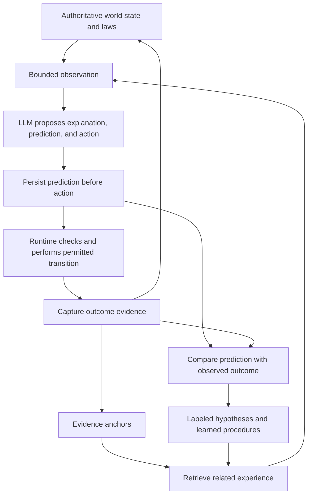

# Keith: a stable world and reconstructive memory

Date: 2026-09-05

Status: research design, revised after the Neo historical review. The companion [implementation plan](keith-causal-memory-implementation-plan.md) turns this model into ordered work with acceptance criteria. The [evidence ledger](keith-causal-memory-evidence.md) separates source observations, historical reports, and proposed conclusions. This research does not change runtime code or feature status; no experimental results are claimed.

## The idea we are trying to make concrete

Keith inhabits a world with dependable causal rules. It predicts what an action will do, observes what actually happened, and improves its understanding through the difference. Its memory retains evidence anchors and uses explicitly labeled, model-generated connections to reconstruct useful explanations between them.

The user's chair analogy expresses transfer: incidental changes such as color or location should not require relearning a causal relationship. The design must also represent conditions that change the outcome, such as whether an object is anchored. Learning includes discovering which differences matter.

The user's memory idea gives generation a deliberate role: sparse observations can support useful reconstructed accounts. Observation, inference, uncertainty, and missing information must remain distinguishable throughout that process.

The starting reference is the user's [Compiled World Runtime paper](https://compiled-world.sites.paxeer.app/). Its fixed World ABI, mutable durable state, observation compiler, and transition kernel provide the operational foundation. The proposed Keith adaptation seals native semantics per world version, permits new content and procedures within those semantics, and requires an explicit version transition when an installed capability changes. The implementation plan defines how this fits Keith's existing plugins and self-evolution boundaries.

The user's [Latent Relatedness paper](https://latent-relatedness.sites.paxeer.app/) supplies a proposed direction for anchor selection: infer underlying priorities from distributed user signals, then use those provisional priorities to estimate which experiences will matter later. The paper distinguishes inference capacity from the durable scaffolding required to accumulate and revise a user model. Applying it to memory selection is a design hypothesis to evaluate.

## A concrete system boundary

The ordinary deployed LLM can propose explanations, predictions, and actions. Durable runtime components preserve evidence, enforce transition rules, and decide whether an observation satisfies a recorded success condition. The first version would change behavior through memory, context, and procedures; it would not require updating model weights.



The diagram groups roles, not processes. This can remain one Keith with one daemon and its existing worker boundaries. It does not require a separate agent for every box.

A label cannot guarantee that a model reasons correctly. The runtime can enforce provenance and action permissions even when the model misinterprets a labeled hypothesis.

## What the world guarantees

Candidate laws include:

- Objects retain identity across observations, conversations, and restarts.
- Changes create revisions; a proposal referring to an obsolete revision receives an explicit response.
- Every consequential operation has durable intent and an attempt identity before dispatch.
- A locally unresolved external effect remains unresolved after restart. A timeout does not establish that the external effect failed.
- Repeating an equivalent consequential operation must respect its existing effect and reconciliation state, including through alternate paths where equivalence can be established.
- Retry allowances are durable and cannot reset through conversation compaction, a fresh model call, or superficial argument changes.
- Completion requires evidence for the requested outcome. An unavailable next action can lead to an honest incomplete state.

The rules are consistent; external services can still behave unpredictably. The runtime can guarantee its own admission and state transitions. Safe handling of remote effects also depends on adapter support, provider idempotency, and authoritative reconciliation. A generic shell or browser action does not automatically expose enough information to deduplicate every effect inside it.

Objects, remaining budgets, connections, and permissions are authoritative state. The rules governing how they change belong to the versioned world contract.

## Selecting anchors through user patterns

The proposed selector estimates the future usefulness of evidence for this user, in the relevant project or situation. Frequency and semantic similarity are inputs. A candidate memory can also matter because it reveals an exception, changes an expectation, or resolves an uncertainty about what the user is trying to accomplish.

A pattern is a hypothesis in the existing memory structure, with a claim, scope, supporting signal IDs, counterexamples, relevant time period, and revision history. It is not a new authority over user intent. For example, repeated corrections about unfinished work, requests for restart recovery, and efforts to avoid repeating instructions might suggest a priority of continuity across interruptions. That is an illustrative inference, not a claim that these exact signals were observed in this session.

### Candidate flow

1. **Capture observations before deciding their enduring importance.** Retain attributable recent signals in a bounded evidence buffer under the profile's data policy. Explicit requests to remember something, corrections, commitments, and operational obligations receive their own handling without waiting for a recurring pattern.
2. **Assemble related signals.** Use embeddings and explicit relationships to bring together relevant requests, choices, corrections, and observed feedback across episodes. Preserve who supplied each signal and what task it concerned.
3. **Generate competing pattern hypotheses.** Ask the model what might explain the collection, with exact signal references and alternative explanations. Doing work on a topic does not establish that the user personally likes it. A project-specific preference does not automatically apply everywhere.
4. **Estimate what retaining an event would improve.** Candidate reasons include serving an ongoing goal, respecting a demonstrated preference, resolving an open commitment, avoiding a consequential mistake, or distinguishing competing explanations of user priorities. Store the reason for selection.
5. **Promote useful evidence into anchors.** A newly discovered pattern may justify retaining an older observation if the original evidence is still available. Preserve decisive counterexamples and unfamiliar signals even when they fit no current pattern.
6. **Reconstruct and act with labels intact.** At recall, supply anchors, provisional patterns, counterexamples, and gaps separately. Pattern-dependent personalization remains constrained by the current request and the runtime's explicit authority rules.
7. **Evaluate later usefulness.** Observe whether selected memories helped on subsequent tasks and whether user feedback supports the inferred priority. Revise the pattern and selection policy when evidence changes.

This two-stage capture-and-consolidate approach addresses the bootstrap problem: a signal can look ordinary at arrival and become important only when another signal appears later. Evidence that has already expired cannot be recovered by inventing it; reconstruction must preserve that gap.

### What changes for retention

| New evidence | Possible reason to retain it |
|---|---|
| A direct user correction | Changes which inference or preference is applicable |
| A modest detail consistent with several independent signals | Helps establish an underlying priority |
| A counterexample to a strong inferred pattern | Prevents an overly broad user model |
| An unusual outcome with serious consequences | Has future decision value despite low frequency |
| A promise or unresolved operation | Must remain available under commitment or world-state rules |
| A novel signal with no clear interpretation | May become meaningful when later evidence arrives |

Repeated model-generated reconstructions do not count as repeated user signals. Silence is not explicit confirmation. A pattern that changes what Keith shows the user must not treat every resulting interaction as independent proof of its original guess.

Known commitments, unresolved effects, and required authority information remain available independently of the pattern selector. Inferred user preferences influence optional retention and retrieval; they cannot silently erase operational truth.

The paper's discussion of self-reinforcement motivates preserving alternatives and correction. Our practical test would be whether selection conditioned on provisional user patterns improves future tasks compared with explicit-preference, recency, and frequency baselines at the same memory budget. A coherent profile or theme alone does not prove usefulness.

## What memory stores

These are conceptual record families, not a finalized schema or database choice.

| Record | What it represents | Essential information |
|---|---|---|
| Anchor | An attributable observation or assertion | ID; profile; object and revision; source and digest; observed and recorded times; provenance class; correction and retention state |
| Relationship | A connection among anchors, objects, episodes, or hypotheses | Relation type; endpoints; whether observed or inferred; supporting and contradicting evidence; applicability conditions; generation provenance |
| Hypothesis | A possible explanation of evidence | Claim; referenced anchors; assumptions; alternatives; unresolved questions; validation history; model and world versions |
| Prediction | An expectation recorded before acting | Proposed action; target revision; assumptions; expected effects; observation deadline; evidence required; uncertainty; supporting hypothesis IDs |
| Assessment | What the available observations establish about a prediction | Confirmed, contradicted, pending, or unresolvable status for each expected effect; evidence references; evaluator version; residual ambiguity |
| Procedure | A reusable decision strategy | Trigger conditions; steps; expected result; exceptions; supporting episodes; counterexamples; applicability and validation history |

An anchor means that a particular source supplied a particular observation. A user assertion, a tool response, and a runtime fact have different provenance. Recording a statement does not establish that every claim in it is true.

Predictions remain unchanged as historical records once the associated attempt begins. Revisions become new records so Keith cannot rewrite an expectation after seeing the outcome. A prediction about what will happen if an action executes is not scored as an execution failure when admission rejects the action before dispatch.

A hypothesis does not become an observation by being repeated or judged persuasive. New observations can support it, narrow it, or contradict it while its inferential origin remains visible. A successful experiment is an anchor about that experiment; the generalization beyond it remains conditional.

Corrections propagate to dependent explanations and retrieval results. Deleting source evidence must remove it from active use and invalidate or remove derived material as required by retention and forgetting rules. Historical records must not silently retain active references to evidence that no longer supports them.

## How embeddings and multiple relationships fit

Embeddings are one way to find possible relevance. Explicit relations describe what relevance means. A numerical embedding coordinate should not be assumed to correspond to a named concept such as cause or time.

The same episode can be reached through several relationships:

- Temporal: happened before, overlapped, followed a restart.
- Entity: involved this service, artifact, account, or person.
- Causal: may have caused, contributed to, or prevented an outcome.
- Intentional: served this goal or violated an expectation.
- Procedural: used this sequence of actions or recovery method.
- Evidential: supports, contradicts, corrects, or leaves unresolved.
- Analogical: resembles another situation in a potentially useful way.

A practical retrieval path would first enforce profile and data boundaries, retrieve candidates through exact IDs, lexical matching, and embeddings, then traverse a bounded number of relevant relationships. Corrections and counterexamples should accompany the selected explanation. Similarity scores determine relevance, not truth.

The LLM can propose a shared mechanism between otherwise dissimilar episodes. That connection starts as an analogy or hypothesis. Its conditions need examination before Keith transfers an action strategy across domains.

A local ledger with indexed records and edges is a plausible starting point. A dedicated graph database or several specialized embedding models is an open optimization choice, not a prerequisite of the idea.

## Embedding strategy with room to optimize for quality

The user's current direction is that the reviewed embedding prices are inexpensive enough to support whichever models and as many useful representations as the design needs. The working priority is retrieval quality and useful transfer, with latency, storage, and total model usage measured separately. Provider selection remains open during brainstorming.

One canonical experience can have multiple retrieval views:

| View | What Keith could retrieve through it |
|---|---|
| Observation meaning | Anchors describing similar observed events |
| Episode context | An observation interpreted alongside the attributable surrounding events |
| Action and outcome | Similar preconditions, attempted changes, and recorded consequences |
| Goal and procedure | Experiences serving a similar objective or using a relevant strategy |
| Hypothesis | Generated explanations that may be worth testing against the current evidence |
| Visual or other modalities | Relevant screenshots, documents, audio, or video when present |

These are candidate views to evaluate, not a requirement to create six embeddings for every anchor. A derived description carries its own provenance and remains distinguishable from the observations it describes. Hypothesis embeddings index hypotheses; they do not turn the hypothesis into an observed event. Timestamps, object IDs, revisions, authority, and evidence status remain explicit fields with exact lookup and filtering.

Several views may use the same model on different representations. Different models may also be useful for different views or as complementary retrievers. Their results should resolve to canonical record IDs so one experience appearing through several indexes does not count as several independent observations.

Each index records its model, version, dimensions, input representation, and source revisions. Keep embedding spaces distinct unless compatibility is established. Combine candidate rankings across spaces rather than assuming unrelated vectors or raw similarity scores are directly comparable. Corrections and deletion invalidate every affected view.

Recall would select relevant views, retrieve candidates, merge them by identity, follow bounded relationships, include contradictions, and only then ask the LLM for labeled reconstruction. Additional views and providers should be evaluated by the useful memories they recover and the later decisions they improve. Increasing the number of vectors alone is not a success measure.

## What a model invocation sees

The observation compiler would provide separately labeled blocks, for example:

```text
WORLD STATE
  Publication attempt P17 has an unresolved external outcome.
  An equivalent publish is blocked pending reconciliation.

ANCHORS
  A41: The runtime dispatched P17 with operation key K17.
  A42: The adapter observed a timeout without a usable receipt.

RECONSTRUCTION — GENERATED, UNVERIFIED
  H9: The remote service may have created the report before
      acknowledgement was lost.
  Alternative H10: The remote service may not have accepted it.
  Neither explanation has been established.

RELEVANT EXPERIENCE
  A prior episode resolved an ambiguous write through readback.
  Applicability requires a provider with authoritative readback.

UNKNOWN
  Whether the report exists remotely.

AVAILABLE NEXT ACTION
  Query publication status by operation key, if supported.
```

This is an illustrative frame, not output from a running Keith instance.

Current unresolved effects, authority, and retry state come from the world and remain mandatory. Sparse autobiographical memory must not delete operational obligations. Generated narrative can connect selected anchors without replacing these fields.

## One complete experience

Assume a test integration supports durable operation keys and authoritative readback. The task is to publish one report with a specified content digest.

1. **Before acting:** Keith predicts that one matching report will exist and that an acknowledgement will arrive within the chosen observation window. These are separate expected outcomes. The runtime records the prediction and publication intent before dispatch.
2. **The request times out:** A timeout becomes an observed anchor. Remote existence remains unknown. The runtime prevents an equivalent blind retry.
3. **Keith reconstructs possibilities:** It proposes that publication completed but the acknowledgement was lost, or that publication did not complete. These explanations remain labeled hypotheses.
4. **Keith chooses a discriminating observation:** It queries the operation key. The purpose of this action is to distinguish the explanations.
5. **Readback finds the report:** A new anchor establishes the report's existence and content identity. This supports the publication-success expectation. The acknowledgement expectation was not met. Readback alone may not establish why the acknowledgement was absent.
6. **Keith updates its understanding:** It retains a conditional procedure: when this class of write has an ambiguous acknowledgement, reconcile before retrying. It keeps the supporting episode and any provider-specific limitations.
7. **A later, superficially different task occurs:** Retrieval may connect an ambiguous document creation to this episode. Keith checks that operation identity and readback semantics apply before using the procedure.

The runtime should protect against duplication from the first episode. Learning is visible when Keith later predicts ambiguity more accurately, proposes fewer blind retries, and reaches useful evidence sooner.

## Repeated mistakes and the shift into investigation

When the same causal conditions lead to repeated failure without new evidence, the runtime's retry allowance decreases. Keith receives the exhausted path and the evidence explaining it.

The proposed reasoning behavior is:

1. Name the failed prediction and the assumption behind it.
2. Retrieve relevant anchors, alternatives, and counterexamples.
3. Propose a small number of explanations consistent with the known rules.
4. Choose a permitted observation or experiment that separates those explanations.
5. Update the plan from the new evidence.
6. If no useful authorized experiment exists, preserve the unresolved state and pause or report the limitation.

Thinking longer does not ensure a true solution. Progress needs either better use of existing evidence or new discriminating evidence. A changed action is justified by a changed causal account, changed conditions, or a meaningful new observation.

## How learning persists without changing model weights

Immediate learning updates the available explanations and the current plan. Across tasks, evidence-supported relationships and procedures change what gets retrieved and how Keith predicts and acts. Repeated harness-level defects may later become candidates for the existing independently governed self-evolution process.

Memory growth, procedure adoption, and a harness release are different changes. Neither a generated hypothesis nor a successful procedure grants permission to change world laws or the independent evaluator.

Predicted probabilities, if used, should be evaluated over resolved predictions rather than trusted because the model supplied precise numbers. An initial system can expose validation counts, conditions, and counterexamples alongside qualitative uncertainty. These counts must distinguish independent observations from repeated summaries of the same event.

Review also needs delayed outcomes. An immediate successful return may establish acceptance while the user's actual goal remains pending. Prediction assessment can occur after individual meaningful actions and again at task completion or a later observation deadline.

## Keeping it operationally affordable

The design need not run a full reflective conversation after every action. Compact predictions can accompany meaningful action proposals. Deterministic checks can resolve simple predicates. More expensive reconstruction can be reserved for uncertain outcomes, contradictory evidence, unfamiliar situations, and repeated failures.

Store useful anchors, compact relationships, and selected validated procedures. Generate incidental connective narrative during recall. Do not continually re-ingest that generated narrative as a new source of independent evidence.

The raw operational ledger and the selected experience memory serve different retention needs. A bounded memory may forget descriptive details while durable world state retains unresolved effects and obligations. Historical lessons should retain enough source evidence to remain inspectable under the chosen retention policy.

The tradeoff to measure is successful task performance and useful transfer per unit of latency, tokens, storage, and external action cost. No latency or accuracy benefit has yet been established for this proposal.

## Current Keith footholds

These are source observations from this discussion, not runtime qualification claims:

- [`EvidenceAuthority`](../crates/memory/src/observatory.rs) already distinguishes `RuntimeFact`, `ToolObserved`, `ExternalObserved`, `UserAsserted`, `AssistantGenerated`, and `DerivedInference`. `EvidenceRecord` includes profile scope, source identities and digests, validity, timestamps, and correction references.
- [`MemoryContextBundle`](../crates/memory/src/unified.rs) already represents evidence, temporal neighbors, corrections, contradictions, and gaps. Agent memory writes accept a committed source reference and supporting quote. Extending generated reconstruction requires preserving the distinction between source attribution and evidential support.
- [`select_activation`](../crates/memory/src/activation.rs) already selects bounded memory against an archive revision and validates a frozen activation manifest.
- [`crates/retrieval`](../crates/retrieval/src/lib.rs) exposes lexical, trigram, and optional vector retrieval components.
- [`crates/meta-harness`](../crates/meta-harness/src/lib.rs) has causal-role and expected-versus-observed evidence structures for harness diagnosis. [`docs/features/self-evolution.md`](../docs/features/self-evolution.md) describes independently governed candidate evaluation and promotion.

Those components are useful starting points. They do not establish that Keith currently implements a sealed World ABI or the general prediction/reconstruction/assessment loop proposed here. A focused source inspection is insufficient to claim every inference label survives every client, summary, and memory transformation.

## How we could tell whether the idea works

A future experiment should separate the contributions, using matched task coverage, the same deployed model, and explicit resource budgets:

1. Existing Keith behavior.
2. Stable world rules and durable observations.
3. The same world plus predictions and anchor retrieval.
4. The same world plus predictions, anchors, and labeled generated reconstruction.

The comparisons should test changed incidental details, changed causally important conditions, misleading analogies, contradictory evidence, compaction, restarts, and unavailable observations. Reusing the same completed episode as its own evaluation would not establish transfer.

Useful measurements include actual duplicate effects, repeated invalid proposals, verified task outcomes, uncertainty calibration, time to useful evidence, applicability errors, and unsupported claims presented as observations. A denial from the kernel proves enforcement; fewer inappropriate proposals on later unfamiliar cases is evidence relevant to learning.

The reconstruction layer earns its cost only if it improves those outcomes beyond anchor retrieval alone. More fluent recollections are insufficient evidence.

Evaluate user-pattern-based anchor selection separately from reconstruction. Hold retrieval and reasoning constant while comparing selectors on subsequent user tasks, including changing preferences and deliberately misleading early impressions. Measure missed important facts, unnecessary repeated questions, inappropriate personalization, and preservation of corrective evidence.

## What the Neo history changes

The historical review establishes concrete failure mechanisms, not a complete production timeline. The user's account identifies loss of Cortex embeddings during provider/hosting changes as the major underlying regression. The available records establish an earlier missing-embedder incident, later retrieval and indexing gaps, and independent delivery/control defects; they do not identify every affected deployment. See [historical evidence and limits](keith-causal-memory-evidence.md).

Five requirements follow:

1. **Semantic memory is a core capability with independent configuration and measurable health.** A working chat model, non-null client, populated vector array, or successful store write cannot establish that meaning-based recall reaches the next decision.
2. **Operational knowledge bypasses optional ranking.** Task-bound object identifiers, corrections to those objects, commitments, unresolved effects, and current capability revisions must be resolved explicitly. The system reports missing required evidence rather than treating a top-K miss as absence.
3. **Observed, generated, committed, and delivered are different states.** A rejected answer remains a rejected candidate; its existence cannot establish that the user received it. A tool response can establish what the tool returned without establishing that the intended task succeeded.
4. **Inference cannot manufacture its own evidence.** Generated explanations and user-pattern hypotheses retain their origin through retrieval, summaries, consolidation, and reconstruction. Repetition, exposure, and silence are not independent confirmation.
5. **One owner governs each decision.** The plan extends Keith's existing memory, session, tool, and finalization boundaries. New prediction checks return typed evidence to those owners; they do not introduce another competing terminal gate or an independent memory authority.

## Current integration gap to resolve first

Source inspection on 2026-09-05 found that automatic activation follows `local-runtime -> select_activation -> MemoryObservatory::search`. That search currently combines lexical overlap and trigram similarity. The separate retrieval crate has an `Embedder` interface and optional vectors; its `LocalHashEmbedder` hashes word-prefix and character features. This is a useful local text-similarity baseline, but it is not a trained semantic embedding model. The memory activation path inspected here does not establish use of that separate vector service.

Consequently, merely adding an embedding provider to workspace search would not satisfy the plan. The first semantic milestone must demonstrate committed evidence becoming searchable, a paraphrased query retrieving it, and that exact evidence revision appearing in the automatic context used by a real Keith turn. These are source observations, not a claim that any deployed instance was tested. [Exact source map](keith-causal-memory-evidence.md#current-keith-source-observations).

## Working decisions for implementation

| Area | Proposed baseline |
|---|---|
| World stability | Version native action semantics; bind each admitted action to capability, object, and policy revisions. New external observations remain uncertain until resolved. |
| Memory authority | Extend existing profile-scoped evidence and memory services; keep vectors, summaries, and inferred graphs rebuildable. |
| Embeddings | One trained semantic model in the real memory path first; exact and lexical lookup remain available. Multiple providers and views follow measured benefit. |
| Relationships | Start with identity, source, time, correction, support, contradiction, and task membership. Proposed causal/analogical edges remain hypotheses. |
| Prediction | Required for effects and meaningful experiments; routine reads use lightweight observation intent. Assessment unavailability is explicitly unknown. |
| Repeated failure | Persist strategy attempts; one controller requests a discriminating observation or revised approach. No second controller may discard an otherwise valid answer. |
| Reconstruction | Generated on demand, optional, and structurally labeled. It may suggest an explanation or next probe; it may not invent a historical event or operational identifier. |
| Importance | Obligations and explicit corrections first; provisional user patterns rank optional memories and preserve counterexamples. |
| Learning | Conditional advice from attributable episodes; independent later evidence is required for broader reuse. Harness changes use existing protected self-evolution. |
| Experience | Natural conversation with inspectable evidence. Internal uncertainty is surfaced when it affects the answer or next action. |

These are concrete proposed defaults for the plan, not claims that the user has individually approved every parameter. Provider choice, empirical thresholds, and retention limits remain explicit experiment decisions. See the [phases and first implementation slice](keith-causal-memory-implementation-plan.md#implementation-phases).
