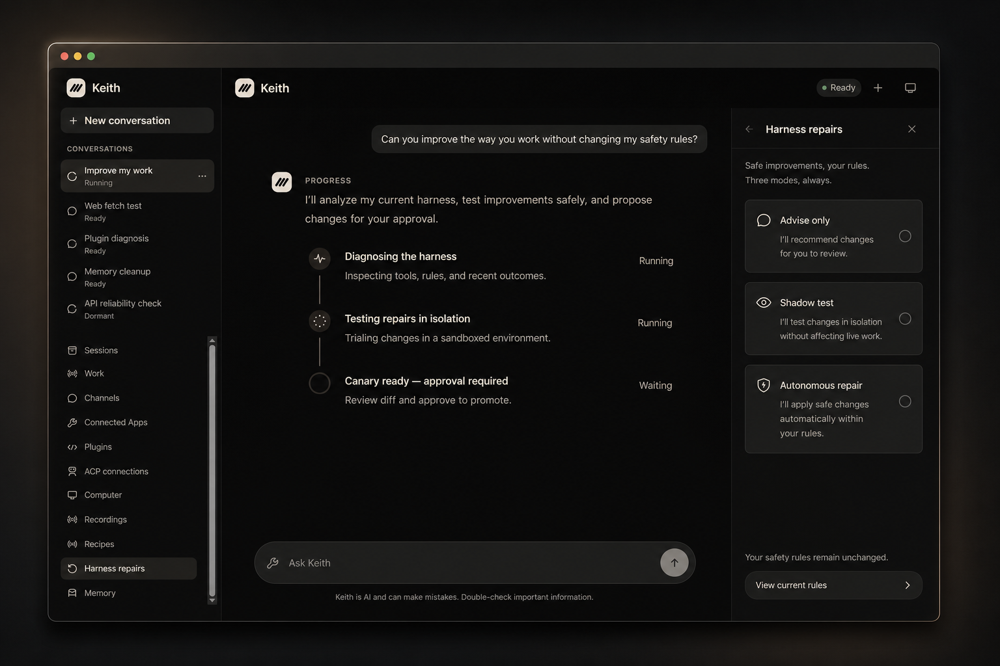

<h1 align="center">Keith</h1>

<p align="center">
  <strong>הסוכן הראשון שמתפתח באמת — לא באמצעות טריקים של prompt, אלא על־ידי שינוי, בדיקה וקידום בטוח של שינויים ב־harness שלו עצמו.</strong>
</p>

<p align="center">
  Keith הופך ניסיון אמיתי לשינויים במנגנון שמעצב איך הוא מסיק, בוחר כלים, מנהל
  הקשר ומבצע עבודה — לא עוד הערה ב־prompt. כל גרסה חדשה נבנית בבידוד, נבדקת
  מול Keith הנוכחי, ומאומצת רק אם היא מוכיחה את עצמה טובה יותר מבלי לחצות את
  גבולות האבטחה שלך.
</p>

<p align="center">
  <a href="https://github.com/Sidiora-Labs/keith-agent/actions/workflows/ci.yml"></a>
  <a href="https://github.com/Sidiora-Labs/keith-agent/releases/latest"></a>
  <a href="https://github.com/Sidiora-Labs/keith-agent/stargazers"></a>
  <a href="LICENSE"></a>
  <a href="https://github.com/Sidiora-Labs/keith-agent/pkgs/container/keith-agent"></a>
</p>

<p align="center">
  <a href="docs/installation.md">התחלה</a> ·
  <a href="docs/deployment.md">פריסה</a> ·
  <a href="docs/crate-guide.md">ארכיטקטורה</a> ·
  <a href="CONTRIBUTING.md">תרומה</a> ·
  <a href="SECURITY.md">אבטחה</a>
</p>

<p align="center">
  
</p>

<p align="center"><sub>למד מעבודה אמיתית. בנה harness טוב יותר. הוכח את השיפור לפני שהוא עולה לייצור.</sub></p>

> [!IMPORTANT]
> Keith הוא תוכנה בגרסה טרום־השקה. הליבה פועלת, אך ממשקים, אחסון ואריזה עוד
> עשויים להשתנות לפני 1.0.

## נסה את זה

הדרך הקצרה ביותר היא Docker:

```bash
cp .env.example .env
# הגדר KEITH_WEB_LOGIN_SECRET ומפתח של ספק מודל אחד ב־.env.
docker compose up --build
```

פתח את <http://localhost:7341>. Keith שומר את המצב שלו בנפח `keith-data`
ויכול לעבוד בתוך ה־checkout הנוכחי בנתיב `/workspace`.

מעדיף פיתוח מהמקור?

```bash
./keith doctor
./keith setup
./keith dev
```

עיין ב[מדריך ההתקנה](docs/installation.md) לגבי TUI, הגדרת ספקים, שדרוגים,
גיבויים וניהול שירות.

## איך Keith מתפתח

כל הרצה נותנת ל־Keith יותר מתמלול. היא מפיקה עדויות על איך כל הסוכן עבד:
מסלול ההיסק, בחירות הכלים, השימוש בהקשר, זמן התגובה, העלות, ההתאוששות
והתוצאה הסופית.

כשל קשה יכול לחשוף הזדמנות להתפתחות, אך גם קריאת כלי מבוזבזת, התאוששות איטית,
או תוצאה שיכלה להיות טובה יותר — יכולים לעשות זאת.

Keith הופך את ההזדמנות החזקה ביותר להשערה ניתנת לבדיקה, בונה מספר
harnesses מועמדים הרחק מהמערכת החיה, ומשווה אותם לגרסה הנוכחית על עבודה
שהמציע לא ראה. מועמד מתקדם רק אם הוא מייצר שיפור מדיד מבלי להכניס רגרסיה.

```text
ניסיון → הזדמנות → השערה ניתנת לבדיקה → harnesses מועמדים
     ← הערכה חבויה ← canary ← התבוננות ← שמירה או החזרה
```

זהו ההימור המרכזי מאחורי Keith: סוכן לא צריך רק לבצע עבודה. עליו להחזיק
דרך בטוחה וניתנת לבדיקה להפוך לטוב יותר בביצוע העבודה.

### תקן תוך כדי עבודה

Keith Computer הוא שולחן־עבודה גלוי ומבודד. צפה בהרצה בזמן אמת, קח את
המקלדת והמצביע בפעולה אחת, תקן את הבעיה, והחזר את השליטה. חוזה שליטה
בלעדי מונע ממך ומ־Keith להיאבק על אותו מסך.

### למד את העבודה, לא prompt נוסף

כשאתה מדגים משימה, Keith מתעד את המבנה המועיל שמאחוריה: מצב המסך, פעולות
מקלדת ומצביע, יעדי UI, הקשר היישום, תזמונים, נרטיב, קבצים, פעילות לוח
הגזירים, וכל מסירת שליטה. הוא הופך עדויות אלה ל־**TaskRecipe** ניתן
לעריכה, עם קלטים, נקודות בקרה, אישורים, שלבי התאוששות, גרסאות ו־rollback.

אתה לא רק נותן ל־Keith הקלטת מסך. אתה מראה לו חתיכת עבודה שהוא יכול
להריץ מחדש ולשפר.

### תן לו לתקן את ה־harness, לא את הכללים

תיקון עצמי שימושי רק אם המועמד לא יכול להזיז את עמודי השער. מועמדי התיקון
של Keith לא יכולים לערוך את השופט, מקרי בדיקה חבויים, אישורי גישה, את מה
ש־Keith רשאי לזכור או לחשוף, את כללי האישור שלך, בדיקות גרסה, שער קידום,
או מסלול ה־rollback.

בחר עד כמה Keith רשאי להגיע:

- **ייעוץ בלבד**   יסביר את התיקון המוצע ויחכה.
- **בדיקת צל**   יבנה ויבדוק מועמדים, אך לא יקדם אף אחד.
- **תיקון אוטונומי**   canary, התבוננות והחזרה בגבולות שהגדרת.

בכל מצב, הכללים המוגנים נשארים מחוץ להישג ידו של המועמד.

### Keith אחד, לא תיקיית בוטים

Web UI, TUI, ה־API התואם ל־OpenAI, ה־API המקורי, לקוחות ACP, ערוצי הודעות,
אפליקציות מחוברות והמחשב — כולם מגיעים לאותו סוכן שבבעלות ה־daemon. עובדים
מומחים יכולים לחקור, לכתוב קוד או להפעיל כלים מאחורי הקלעים מבלי להפוך
את המוצר ללוח מחוונים מלא באישיויות שצריך לנהל.

סשנים שורדים ניתוקי לקוח. התחייבויות, המתנות, עבודה מתוזמנת, מטרות והרצות
פעילות יכולות להשתקם לאחר הפעלה מחדש. התחל בטרמינל, בדוק מ־Slack, וסיים
בדפדפן — בלי ליצור שלושה עוזרים חסרי קשר ביניהם.

## מה אפשר לעשות עם Keith

| אתה רוצה… | Keith יכול… |
| --- | --- |
| להאציל משימת דפדפן או שולחן־עבודה | לעבוד במחשב עם מסך או ב־headless בזמן שאתה צופה, משהה או תופס שליטה |
| ללמד תהליך עבודה חוזר | להפוך הדגמה חיה ל־TaskRecipe ניתן לעריכה ולהרצה חוזרת |
| להפסיק לחזור על אותו כשל סוכן | לאבחן את ה־harness, לבדוק תיקונים מתחרים, לשחרר את הזוכה ב־canary, ולהחזיר |
| להשתמש במודלים שלך | לנתב פרופילים דרך OpenAI, Anthropic, OpenRouter, Ollama או ספק נתמך אחר |
| להגיע לאותו סוכן מכל מקום | לשרת לקוחות Web, TUI, ACP, API, Discord, Slack, Telegram, WhatsApp, Teams, Google Chat, דוא״ל ו־Matrix |
| לחבר שירותים אמיתיים | להשתמש באפליקציות מחוברות עם אישור, ב־Composio, בשרתי MCP, ובתוספי WASI עם היקף יכולות |
| לבנות מעל Keith | להשתמש ב־API `/v1` התואם ל־OpenAI, או ב־API `/platform/v1` המקורי והמוקלד |
| להריץ על התשתית שלך | לפרוס עם Docker, Kubernetes, Railway, Fly.io, DigitalOcean, Azure, AWS או Google Cloud |

## סביבת ריצה אחת, כניסות רבות

```text
Web · TUI · OpenAI API · Platform API · ACP · ערוצים
                         │
                      agentd
              סשנים · מדיניות · התאוששות
                         │
        עובדי סוכן בחוזה השכרה
                         │
   מודלים · כלים · תוספים · CUA · אפליקציות מחוברות
```

`agentd` הוא הבעלים של האמת. הלקוחות רק מציגים את הסשנים ומחזור החיים שלו,
במקום להמציא מצב משלהם. העובדים מבצעים תורות תחת חוזי השכרה, ו־crates
התחום שומרים על הפרדה בין המדיניות למתאמים חיצוניים.

קרא את [מדריך ה־crates](docs/crate-guide.md) ואת
[גבולות התלויות](docs/architecture/dependency-boundaries.md) למפת המערכת
המלאה.

## ממשקי API והרחבות

Keith חושף שני משטחי HTTP:

- **`/v1` תואם OpenAI** עבור SDKs קיימים וכלים כמו Open WebUI.
- **`/platform/v1` מקורי** עבור לקוחות מהימנים שזקוקים לסשנים, מחזור חיים,
  אישורים, artifacts ואירועים חיים של Keith.

הרחבות יכולות לרוץ כרכיבי WASI עם היקף יכולות, כשרתי MCP, כ־skills, או
כאפליקציות מחוברות הדורשות אישור. לקוחות ACP יכולים להתחבר דרך שרת stdio
מצורף. ראה [תאימות OpenAI](docs/openai-compatibility.md) ו
[שילוב פלטפורמה](docs/platform-integration.md).

## אבטחה

> [!WARNING]
> Keith יכול להריץ פקודות, לשנות קבצים, לשלוט בדפדפן, ולקרוא לשירותים חיצוניים
> עם ההרשאות שתעניק לו. השתמש בסביבת עבודה שניתנת לבדיקה ולשחזור. התייחס
> לפלט המודל, להודעות בערוצים, לדפים שנשלפו, לתוספים, ל־skills, לשרתי MCP
> ולמועמדי תיקון כאל דברים לא מהימנים.

השאר את ה־Web UI ואת ה־APIs על loopback אלא אם כן אתה מוסיף TLS, אימות
חזק ומדיניות רשת מפורשת. השתמש בסודות שונים לכניסת Web, ל־APIs, לספקי
המודלים ולחתימת גרסאות. לעולם אל תפרסם אישורי גישה או traces לא
מצונזרים ב־issue ציבורי.

דווח על חולשות באופן פרטי דרך
[טופס security advisory](https://github.com/Sidiora-Labs/keith-agent/security/advisories/new)
ב־GitHub. קרא את [SECURITY.md](SECURITY.md) למודל האמון, להיקף ולכללי
הדיווח.

## פריסה

Keith מגיע כתמונת OCI אחת עם state, עם מסלולים נתמכים עבור Docker Compose,
Kubernetes עם Helm, Railway, Fly.io, DigitalOcean Kubernetes, Azure
Kubernetes Service, Amazon EKS ו־Google Kubernetes Engine Autopilot.

```bash
./keith deploy kubernetes --render
./keith deploy railway
./keith deploy fly --app my-keith
./keith deploy aws --cluster keith --region us-east-1
```

פקודות ענן מדפיסות תוכנית כברירת מחדל. פריסה משנה תשתית רק כשמעבירים
`--execute` ומגדירים `KEITH_DEPLOY_APPROVED=YES`. קרא את
[מדריך הפריסה](docs/deployment.md) המלא לפני חשיפת Keith מחוץ למארח.

## פיתוח והרחבה

הפקודה `./keith` היא נקודת הכניסה של התורם להגדרה, שירותים מקומיים,
בדיקות, בניית גרסאות, תמונות קונטיינר, סקפולדינג ותוכניות פריסה. פלט הבילד
של Rust נשאר מחוץ ל־checkout.

```bash
./keith check
./keith test
./keith image keith-agent:dev
./keith scaffold plugin my-plugin
./keith scaffold skill my-skill
```

נדרשים Rust 1.93, Node.js 22.22, Corepack ו־Git. לפני פתיחת pull request,
קרא את [CONTRIBUTING.md](CONTRIBUTING.md) ודווח על הפקודות ונתיבי
המשתמש האמיתיים שאכן הרצת.

## תיעוד

| מטרה | התחל כאן |
| --- | --- |
| התקנה, הגדרת ספק, או הרצת TUI | [התקנה ומחזור חיים](docs/installation.md) |
| הרצה עם Docker או ספק ענן | [מדריך פריסה](docs/deployment.md) |
| חיבור OpenAI SDK או Open WebUI | [תאימות OpenAI](docs/openai-compatibility.md) |
| שילוב לקוח מקורי מהימן | [שילוב פלטפורמה](docs/platform-integration.md) |
| הבנת סביבת העבודה | [מדריך crates](docs/crate-guide.md) |
| הכשרת גרסה | [הכשרת גרסה](docs/release-qualification.md) |
| בקשת עזרה או דיווח על בעיה | [תמיכה](SUPPORT.md) |

## קהילה

- שאל שאלות ושתף רעיונות ב
  [GitHub Discussions](https://github.com/Sidiora-Labs/keith-agent/discussions).
- דווח על באגים ניתנים לשחזור דרך
  [טפסי issue](https://github.com/Sidiora-Labs/keith-agent/issues/new/choose).
- דווח על בעיות אבטחה באופן פרטי, לעולם לא ב־issue ציבורי.
- עקוב אחר [קוד ההתנהגות](CODE_OF_CONDUCT.md) בכל מרחבי הפרויקט.

## רישיון

Keith זמין תחת [Apache License 2.0](LICENSE).
