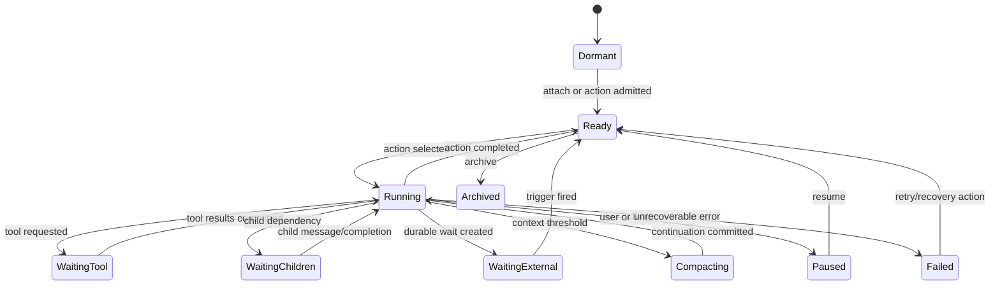
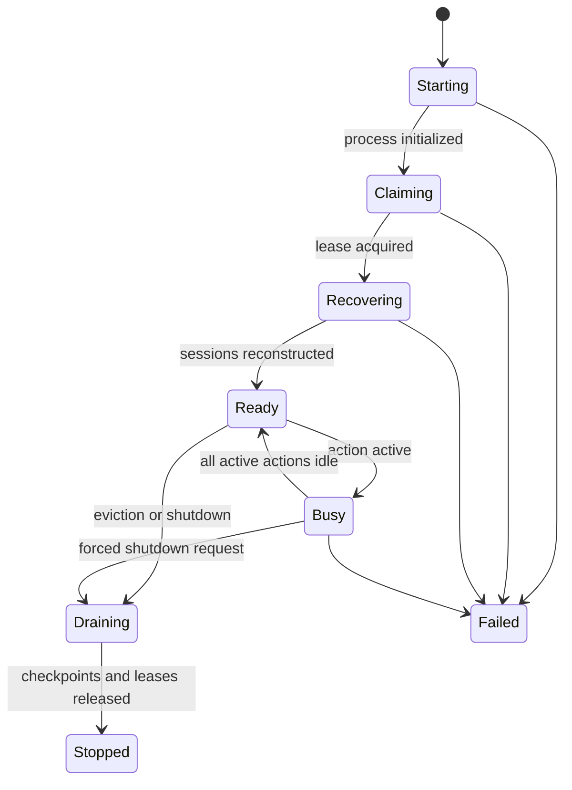
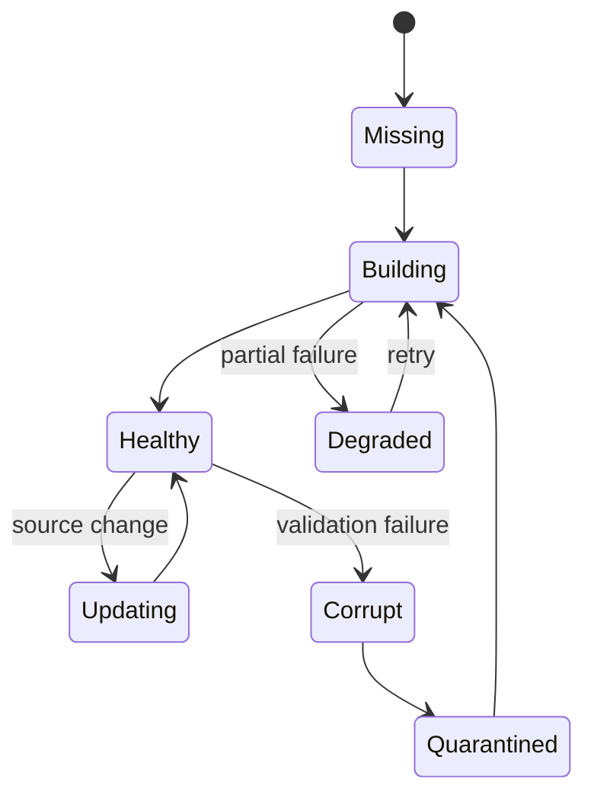
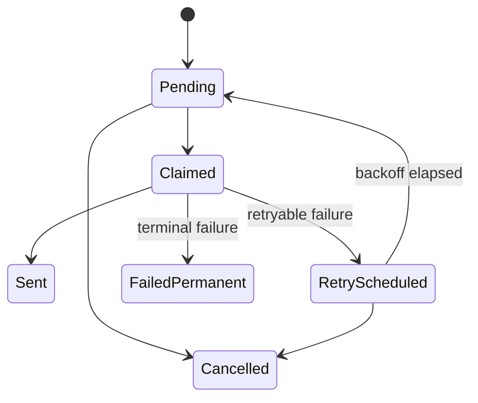
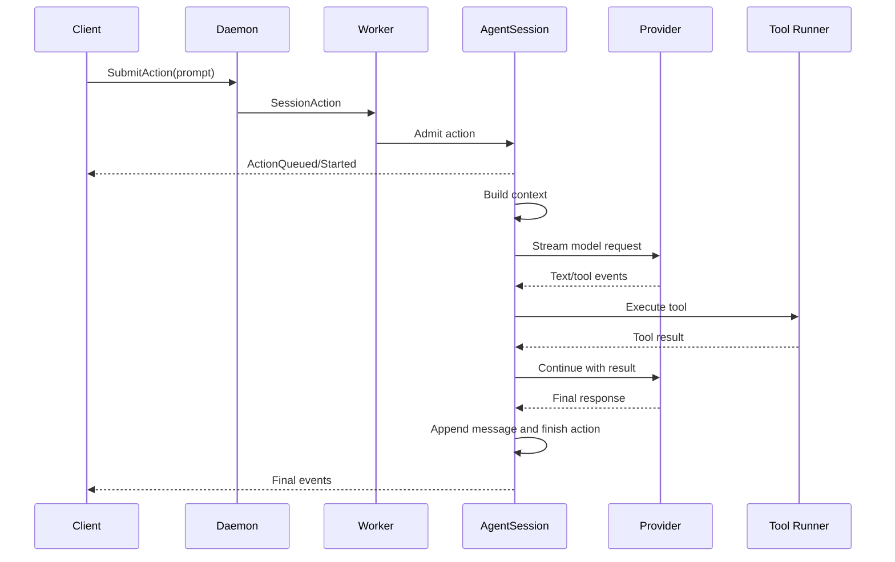
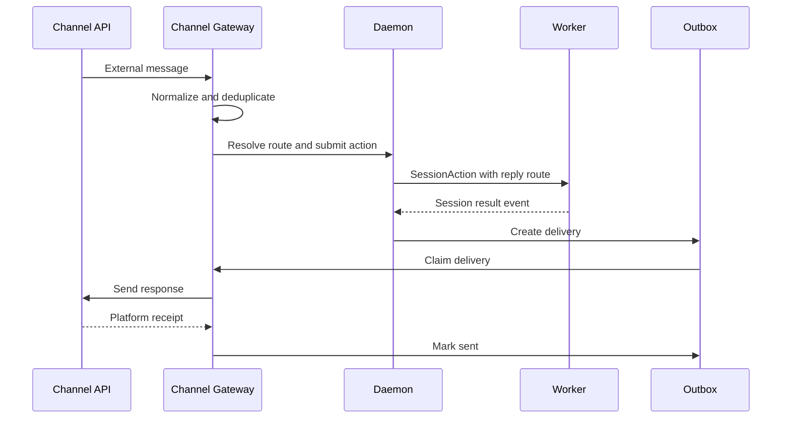
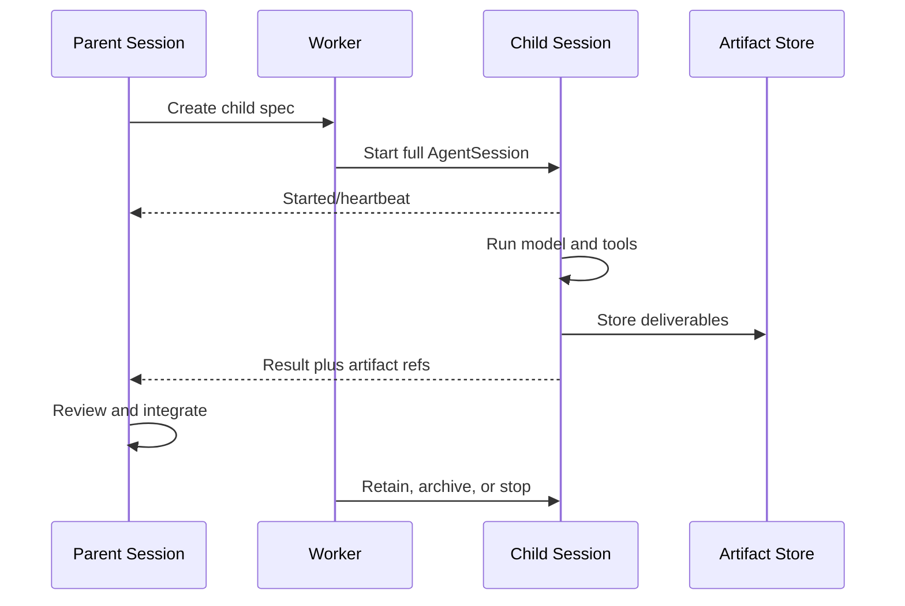
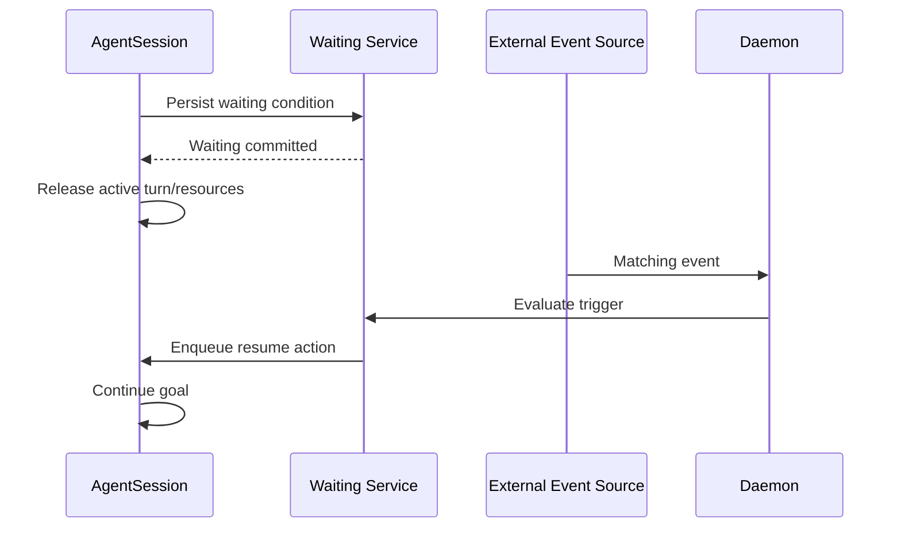
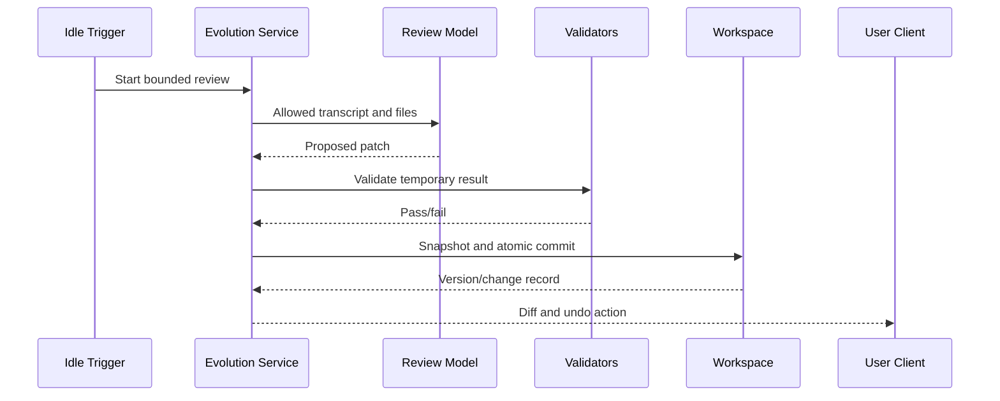

# Unified Rust Agent — Technical Schematics

## Document control

| Field | Value |
|---|---|
| Status | Normative technical baseline |
| Product specification | [blueprint.md](./blueprint.md) |
| Runtime lineage | Delta-1 |
| Assistant/distribution lineage | Gamma-3 |
| Owned implementation language | Rust |
| Reference deployment | Local-first, single user, multi-process |

## 1. Normative language

The words MUST, MUST NOT, SHOULD, SHOULD NOT, and MAY describe implementation requirements.

Rust declarations in this document are schemas and interface contracts. They are intentionally independent of a specific async runtime, database crate, HTTP framework, or UI framework unless a later architecture decision record fixes one.

All persisted and wire-visible types MUST include an explicit version or belong to a versioned envelope.

## 2. System topology

```mermaid
flowchart TB
    subgraph UserDevices["User devices"]
        CLI["CLI / JSON / RPC"]
        TUI["Rust TUI"]
        WEB["Rust/WASM Web"]
        DESKTOP["Rust desktop shell"]
        CHAT["Messaging platforms"]
    end

    subgraph Edge["Edge processes"]
        CGW["channel-gateway"]
        WAPI["web/API endpoint"]
    end

    subgraph Authority["Stable Rust daemon"]
        CONN["Connection server"]
        SUP["Worker supervisor"]
        CAT["Session catalog"]
        ROUTE["Profile/router service"]
        CRON["Scheduler"]
        OUTBOX["Delivery outbox"]
        AWARE["Awareness/attention service"]
    end

    subgraph RootWorker["Root-tree Rust worker"]
        ROUTER["Session router"]
        ROOT["Root AgentSession actor"]
        CHILD["Child AgentSession actors"]
        ACTIONS["Action inboxes"]
        LOOP["Agent loop"]
        CONTEXT["Context builder"]
        GOALS["Goals/plans/waiting"]
        KBROKER["Kernel broker client"]
    end

    subgraph Executors["Restricted execution processes"]
        TOOLRUN["tool-runner"]
        BROWSER["browser-runner"]
        KERNEL["guest kernel"]
        WASI["WASI plugin stores"]
    end

    subgraph External["External services"]
        MODELS["Model providers"]
        MCPS["MCP servers"]
        CHANNELS["Channel APIs"]
        WEBNET["Allowed web destinations"]
    end

    subgraph Durable["Durable local state"]
        STATE["Transactional state store"]
        LOGS["Branched session JSONL"]
        WORKSPACES["Markdown workspaces"]
        INDEX["Rebuildable indexes"]
        ARTIFACTS["Artifacts/snapshots"]
        SECRETS["Credential store"]
    end

    CLI --> CONN
    TUI --> CONN
    WEB --> WAPI
    DESKTOP --> CONN
    CHAT --> CGW
    WAPI --> CONN
    CGW --> CONN
    CONN --> SUP
    CONN --> ROUTE
    SUP --> RootWorker
    CRON --> RootWorker
    AWARE --> RootWorker
    RootWorker --> MODELS
    RootWorker --> TOOLRUN
    RootWorker --> BROWSER
    RootWorker --> KERNEL
    RootWorker --> WASI
    RootWorker --> MCPS
    TOOLRUN --> WEBNET
    OUTBOX --> CGW
    CGW --> CHANNELS
    Authority --> STATE
    RootWorker --> LOGS
    RootWorker --> ARTIFACTS
    ROUTE --> WORKSPACES
    CONTEXT --> WORKSPACES
    CONTEXT --> INDEX
    Authority --> SECRETS
```



## 3. Process inventory

| Process | Count | Owns | Must not own |
|---|---:|---|---|
| `agentd` | One per installation | Public endpoint, supervisor, session catalog, routing, scheduler, awareness, outbox, credentials | Model loop, arbitrary shell, browser content |
| `agent-worker` | One per active root session tree | AgentSession actors, context building, provider streams, child coordination, session writes | Channel connections, global routing, raw credential store |
| `tool-runner` | Zero or more | Restricted filesystem/process tool execution | Session authority, broad secrets, client sockets |
| `kernel-runner` | Zero or more | One guest computational environment | Daemon state, unrelated workspaces |
| `browser-runner` | Zero or more | Isolated browser profile and automation | Daemon credentials, unrestricted host filesystem |
| `channel-gateway` | One or more | Platform connections, message normalization, outbound delivery | Agent loop, personal memory access, arbitrary tools |
| `plugin-runner` | Zero or more | Third-party WASI component instance | Ambient host authority |

### 3.1 Process identity

Every child process MUST receive:

- A generated process instance ID.
- Parent instance ID.
- Protocol version.
- Narrow configuration path or serialized startup configuration.
- Allowed workspace/artifact roots where applicable.
- Resource limits.
- A private authenticated transport endpoint.

Processes MUST NOT discover authority by scanning environment variables or global files.

### 3.2 Failure domains

- A client failure MUST NOT stop the daemon or worker.
- A channel failure MUST NOT stop a session.
- A worker failure MUST affect only its root session tree.
- A tool, kernel, browser, or plugin failure MUST NOT terminate the worker.
- A corrupted search index MUST NOT prevent direct workspace access.

## 4. Rust workspace

```text
workspace/
  Cargo.toml
  crates/
    agent-types/
    protocol/
    framing/
    connection/
    daemon-core/
    supervisor/
    worker-runtime/
    session/
    action-store/
    agent-loop/
    provider-core/
    provider-adapters/
    model-registry/
    session-store/
    state-store/
    goals/
    planner/
    reviewer/
    subagents/
    kernel-protocol/
    kernel-broker/
    tool-core/
    tool-runner/
    sandbox/
    mcp/
    skills/
    plugin-sdk/
    plugin-host/
    profile/
    routing/
    workspace/
    memory/
    knowledge/
    retrieval/
    scheduler/
    commitments/
    waiting/
    awareness/
    attention/
    initiative/
    evolution/
    channel-core/
    channel-adapters/
    delivery/
    artifacts/
    credentials/
    configuration/
    telemetry/
    ui-model/
  apps/
    agentd/
    agent-worker/
    agent-cli/
    agent-tui/
    agent-web/
    agent-desktop/
    channel-gateway/
    tool-runner/
    browser-runner/
    kernel-runner/
```

### 4.1 Dependency direction

```text
agent-types
    ↑
protocol / provider-core / tool-core / channel-core
    ↑
domain crates: session, goals, memory, scheduler, routing, attention
    ↑
orchestration crates: worker-runtime, supervisor, daemon-core
    ↑
applications and clients
```

Rules:

1. `agent-types` MUST depend only on serialization and small utility abstractions.
2. Domain crates MUST NOT depend on UI or concrete channel adapters.
3. `session` MUST depend on provider and tool traits, not concrete implementations.
4. Provider adapters MUST NOT access session storage.
5. Channel adapters MUST NOT import worker-runtime or session internals.
6. Storage backends implement domain repository traits; domain crates do not issue backend-specific queries.
7. Third-party plugin types cross only the versioned plugin SDK boundary.
8. Applications compose dependencies; libraries do not reach upward into applications.

## 5. Common primitives

```rust
pub struct ProtocolVersion {
    pub major: u16,
    pub minor: u16,
}

pub struct EntityId(pub String);
pub struct SessionId(pub EntityId);
pub struct RootTreeId(pub EntityId);
pub struct ProfileId(pub EntityId);
pub struct WorkspaceId(pub EntityId);
pub struct ActionId(pub EntityId);
pub struct TurnId(pub EntityId);
pub struct GoalId(pub EntityId);
pub struct ChildId(pub EntityId);
pub struct ToolCallId(pub EntityId);
pub struct ArtifactId(pub EntityId);
pub struct JobId(pub EntityId);
pub struct DeliveryId(pub EntityId);
pub struct CommitmentId(pub EntityId);

pub struct Sequence(pub u64);
pub struct Generation(pub u64);
pub struct Revision(pub u64);
pub struct UnixMillis(pub i64);
```

Identifiers MUST be globally unique, URL-safe, non-secret, and stable once persisted.

Timestamps MUST be stored in UTC. Time-zone names are stored separately for calendar behavior.

## 6. Public connection protocol

### 6.1 Transport

The protocol is transport independent and supports:

- Framed JSON for debugging and one-shot tools.
- Binary framing for high-volume local streams.
- WebSocket for web and remote clients.

All transports carry the same envelopes.

### 6.2 Handshake

```rust
pub struct ClientHello {
    pub protocol: ProtocolVersion,
    pub client_id: EntityId,
    pub client_name: String,
    pub client_version: String,
    pub supported_features: Vec<String>,
    pub resume: Option<ResumeCursor>,
}

pub struct ResumeCursor {
    pub root_tree_id: RootTreeId,
    pub generation: Generation,
    pub last_sequence: Sequence,
}

pub struct ServerHello {
    pub protocol: ProtocolVersion,
    pub server_instance_id: EntityId,
    pub supported_features: Vec<String>,
    pub current_generation: Option<Generation>,
    pub resume_mode: ResumeMode,
}

pub enum ResumeMode {
    Fresh,
    Delta,
    SnapshotThenDelta,
    Incompatible,
}
```

Major-version mismatch MUST reject the connection. Minor-version mismatch MAY negotiate a common feature subset.

### 6.3 Command envelope

```rust
pub struct CommandEnvelope {
    pub protocol: ProtocolVersion,
    pub command_id: EntityId,
    pub client_id: EntityId,
    pub sent_at: UnixMillis,
    pub session_id: Option<SessionId>,
    pub command: ClientCommand,
}

pub enum ClientCommand {
    ListProfiles,
    ListSessions(SessionFilter),
    CreateSession(CreateSession),
    AttachSession(AttachSession),
    DetachSession,
    SubmitAction(SubmitAction),
    Steer(SteerAction),
    Cancel(CancelTarget),
    PauseGoal(GoalId),
    ResumeGoal(GoalId),
    BranchSession(BranchRequest),
    SelectBranch(SelectBranch),
    SetModel(SetModel),
    SetThinking(SetThinking),
    CreateGoal(CreateGoal),
    UpdateGoal(UpdateGoal),
    CreateSchedule(CreateSchedule),
    UpdateSchedule(UpdateSchedule),
    DeleteSchedule(JobId),
    ResolveConfirmation(ConfirmationResolution),
    ListChildren,
    SendChildMessage(ChildMessageRequest),
    ArchiveChild(ChildId),
    QueryMemory(MemoryQuery),
    ApplyWorkspacePatch(WorkspacePatchRequest),
    UndoWorkspaceChange(EntityId),
    ExportSession(ExportRequest),
}
```

Commands MUST receive a terminal command result even if their resulting session action continues asynchronously.

### 6.4 Event envelope

```rust
pub struct EventEnvelope {
    pub protocol: ProtocolVersion,
    pub root_tree_id: RootTreeId,
    pub generation: Generation,
    pub sequence: Sequence,
    pub emitted_at: UnixMillis,
    pub event: DaemonEvent,
}

pub enum DaemonEvent {
    Snapshot(SessionSnapshot),
    CommandAccepted(EntityId),
    CommandRejected(CommandError),
    SessionCreated(SessionSummary),
    SessionStateChanged(SessionStateChanged),
    ActionQueued(ActionSummary),
    ActionStarted(ActionSummary),
    ActionFinished(ActionFinished),
    TurnStarted(TurnSummary),
    AssistantDelta(TextDelta),
    ReasoningDelta(TextDelta),
    MessageCommitted(MessageSummary),
    ToolStarted(ToolRunSummary),
    ToolProgress(ToolProgress),
    ToolFinished(ToolRunResult),
    GoalChanged(GoalSnapshot),
    PlanChanged(PlanSnapshot),
    ChildChanged(ChildSnapshot),
    KernelChanged(KernelSnapshot),
    WaitingChanged(WaitingSnapshot),
    CommitmentChanged(CommitmentSnapshot),
    ScheduleChanged(ScheduleSnapshot),
    DeliveryChanged(DeliverySnapshot),
    MemoryChanged(MemoryChangeSummary),
    EvolutionChanged(EvolutionSnapshot),
    UsageChanged(UsageSnapshot),
    ConfirmationRequested(ConfirmationRequest),
    Warning(RuntimeWarning),
    Error(RuntimeError),
}
```

Sequences MUST be strictly increasing within one worker generation. Reconnect logic MUST tolerate a generation change by requesting a snapshot before applying later deltas.

## 7. Supervisor-to-worker protocol

The private protocol uses length-prefixed frames over a private local transport.

```text
u32 header_length
u64 payload_length
header bytes
payload bytes
```

The header contains protocol version, message kind, request ID, root-tree ID, worker generation, and payload encoding.

```rust
pub enum SupervisorMessage {
    AdoptRoot(AdoptRoot),
    SubmitAction(SessionAction),
    AttachClient(ClientAttachment),
    DetachClient(EntityId),
    Cancel(CancelTarget),
    QuerySnapshot,
    Shutdown(ShutdownReason),
    GlobalAgentMessage(AgentMessage),
}

pub enum WorkerMessage {
    Ready(WorkerReady),
    Heartbeat(WorkerHeartbeat),
    Event(EventEnvelope),
    Snapshot(SessionSnapshot),
    RootIdle(IdleSummary),
    Fatal(WorkerFatal),
    ShutdownComplete,
}
```

The worker MUST prove ownership of the root lease before accepting actions. The supervisor MUST stop routing to an expired generation.

## 8. Actor model

### 8.1 Actor inventory

| Actor | Mailbox ordering | Persistence boundary |
|---|---|---|
| Supervisor | Global lifecycle order | State store and worker journal |
| Root worker router | Root-tree order | Worker generation and snapshot |
| AgentSession | Per-session serialized mutation | Session JSONL and action state |
| Action pump | Priority plus delivery rules | Pending/running action records |
| Scheduler | Due time then stable job ID | Job and attempt records |
| Delivery worker | Destination queue order | Outbox record |
| Awareness service | Event time plus source sequence | Current state and candidate records |
| Evolution transaction | One workspace transaction | Snapshot and change record |

### 8.2 AgentSession state

```rust
pub enum SessionRunState {
    Dormant,
    Ready,
    Running { action_id: ActionId, turn_id: TurnId },
    WaitingTool { action_id: ActionId, calls: Vec<ToolCallId> },
    WaitingChildren { action_id: ActionId, children: Vec<ChildId> },
    WaitingExternal { action_id: ActionId, waiting_id: EntityId },
    Compacting { action_id: ActionId },
    Paused { reason: PauseReason },
    Failed { error_id: EntityId },
    Archived,
}
```

Only the AgentSession actor may transition its run state. Services return messages or results; they do not mutate the session directly.

### 8.3 Session state machine



### 8.4 Worker lifecycle



## 9. Session action schema

```rust
pub struct SessionAction {
    pub id: ActionId,
    pub session_id: SessionId,
    pub source: ActionSource,
    pub delivery: DeliveryPolicy,
    pub priority: ActionPriority,
    pub created_at: UnixMillis,
    pub not_before: Option<UnixMillis>,
    pub deadline: Option<UnixMillis>,
    pub limits: ActionLimits,
    pub reply_route: Option<ReplyRoute>,
    pub payload: ActionPayload,
}

pub enum ActionSource {
    Interactive { client_id: EntityId },
    Channel { channel: String, message_id: String },
    Schedule { job_id: JobId, attempt: u32 },
    Child { child_id: ChildId },
    FollowUp,
    AutonomousContinuation { goal_id: GoalId },
    Awareness { event_id: EntityId },
    Evolution { transaction_id: EntityId },
}

pub enum DeliveryPolicy {
    Immediate,
    NextTurnBoundary,
    WhenIdle,
}

pub enum ActionPriority {
    Interrupt,
    User,
    ChildResult,
    Scheduled,
    Background,
}

pub struct ActionLimits {
    pub max_turns: Option<u32>,
    pub max_tokens: Option<u64>,
    pub max_elapsed_ms: Option<u64>,
    pub max_tool_calls: Option<u32>,
    pub max_children: Option<u16>,
}

pub enum ActionPayload {
    Prompt(UserPrompt),
    Steering(UserPrompt),
    ChildMessage(AgentMessage),
    ResumeWaiting(EntityId),
    ContinueGoal(GoalId),
    RunEvolution(EntityId),
    SystemMaintenance(MaintenanceAction),
}
```

### 9.1 Action lifecycle

```rust
pub enum ActionState {
    Queued,
    Admitted,
    Running,
    Waiting,
    Completed,
    Failed,
    Cancelled,
    Expired,
}
```

Action selection rules:

1. Expired actions become terminal before selection.
2. Interrupt actions apply only to a compatible active action.
3. User actions outrank background work.
4. FIFO order applies within equal priority.
5. `NextTurnBoundary` actions enter steering after the current tool batch.
6. `WhenIdle` actions run only when no user or child-result action is ready.
7. A session executes at most one model turn at a time.

## 10. Session persistence schema

### 10.1 Session manifest

```rust
pub struct SessionManifest {
    pub version: u32,
    pub session_id: SessionId,
    pub root_tree_id: RootTreeId,
    pub parent_session_id: Option<SessionId>,
    pub profile_id: ProfileId,
    pub workspace_id: WorkspaceId,
    pub created_at: UnixMillis,
    pub active_leaf: EntryId,
    pub label: Option<String>,
    pub archived: bool,
}

pub struct EntryId(pub EntityId);
```

### 10.2 Append-only entry

```rust
pub struct SessionEntry {
    pub version: u32,
    pub id: EntryId,
    pub parent_id: Option<EntryId>,
    pub timestamp: UnixMillis,
    pub payload: SessionEntryPayload,
}

pub enum SessionEntryPayload {
    UserMessage(Message),
    AssistantMessage(Message),
    ToolCall(ToolInvocationRecord),
    ToolResult(ToolResultRecord),
    ModelChanged(ModelSelection),
    ThinkingChanged(ThinkingLevel),
    Compaction(CompactionRecord),
    BranchSummary(BranchSummary),
    GoalChanged(GoalSnapshot),
    PlanChanged(PlanSnapshot),
    ChildLinked(ChildLink),
    Usage(UsageRecord),
    Lifecycle(LifecycleRecord),
    Custom(CustomEntry),
}
```

Each JSONL line contains one complete serialized SessionEntry plus a checksum of its canonical payload. A truncated final line MAY be discarded during recovery; corruption before the final line MUST quarantine the file and require repair rather than silently skipping content.

### 10.3 Branch reconstruction

Given selected leaf `L`:

1. Load the entry index.
2. Walk parent links from `L` to the root.
3. Reverse the resulting list.
4. Find the latest compaction entry compatible with that ancestry.
5. Apply model/thinking changes in ancestry order.
6. Emit compacted context followed by later messages.

Branch creation appends a new entry whose parent is the selected historical entry. It does not rewrite existing lines.

### 10.4 Lease schema

```rust
pub struct SessionLease {
    pub root_tree_id: RootTreeId,
    pub owner_instance: EntityId,
    pub generation: Generation,
    pub acquired_at: UnixMillis,
    pub renewed_at: UnixMillis,
    pub expires_at: UnixMillis,
}
```

The state store MUST update lease ownership transactionally. File-level locking provides a second local guard. A stale worker MUST terminate writes when lease renewal fails.

## 11. Messages and content

```rust
pub struct Message {
    pub role: MessageRole,
    pub content: Vec<ContentBlock>,
    pub provider_meta: Option<ProviderMetadata>,
}

pub enum MessageRole {
    System,
    User,
    Assistant,
    Tool,
}

pub enum ContentBlock {
    Text(String),
    Reasoning { text: String, visibility: ReasoningVisibility },
    Image(ArtifactRef),
    Audio(ArtifactRef),
    Document(ArtifactRef),
    ToolCall(ToolCall),
    ToolResult(ToolResultBlock),
    Resource(ResourceRef),
}
```

Provider-specific content MUST be normalized before entering session storage. Raw provider responses MAY be retained only in opt-in diagnostic storage with secret filtering.

## 12. Provider interface

```rust
pub trait ModelProvider: Send + Sync {
    fn provider_id(&self) -> &str;
    fn list_models(&self) -> ProviderFuture<Vec<ModelDescriptor>>;
    fn stream(&self, request: ModelRequest) -> ProviderStream<ModelEvent>;
    fn count_tokens(&self, request: TokenCountRequest) -> ProviderFuture<TokenCount>;
    fn cancel(&self, request_id: EntityId) -> ProviderFuture<()>;
}

pub struct ModelRequest {
    pub request_id: EntityId,
    pub model: ModelSelection,
    pub system: Vec<ContentBlock>,
    pub messages: Vec<Message>,
    pub tools: Vec<ToolDefinition>,
    pub thinking: ThinkingLevel,
    pub max_output_tokens: Option<u32>,
    pub temperature: Option<f32>,
    pub cache_hints: Vec<CacheHint>,
}

pub enum ModelEvent {
    Started(ProviderMetadata),
    TextDelta(String),
    ReasoningDelta(String),
    ToolCallStarted(ToolCallId),
    ToolCallArgumentsDelta { id: ToolCallId, delta: String },
    ToolCallCompleted(ToolCall),
    Usage(UsageRecord),
    Finished(StopReason),
    Failed(ProviderError),
}
```

### 12.1 Model selection

```rust
pub struct ModelRoute {
    pub primary: ModelSelection,
    pub fallbacks: Vec<ModelSelection>,
    pub classification_model: Option<ModelSelection>,
    pub summarization_model: Option<ModelSelection>,
    pub review_model: Option<ModelSelection>,
    pub vision_model: Option<ModelSelection>,
}

pub struct ModelSelection {
    pub provider: String,
    pub model: String,
    pub credential_ref: Option<String>,
}
```

Provider fallback MUST consider error class. Authentication errors, invalid requests, content-policy rejections, and user cancellations MUST NOT be retried as transient failures.

Profile-level model selection MUST be applied during real session construction.

## 13. Agent loop algorithm

```text
run_action(action):
  enforce action limits and cancellation
  build context manifest
  select model route

  for turn in 1..max_turns:
    persist turn-start lifecycle
    stream provider events
    normalize assistant content and tool calls

    if provider failure:
      classify, retry, fallback, or fail

    if no tool calls:
      commit assistant message
      run bounded review when required
      finish action

    validate tool call/result adjacency
    reject malformed or duplicate call IDs
    partition calls into safe parallel reads and serialized effects
    execute with cancellation, timeouts, and output limits
    commit every tool call and result

    if repeated same failure exceeds limit:
      inject strategy-change instruction or fail

    if context threshold crossed:
      compact selected branch atomically

  fail with turn-limit outcome
```

### 13.1 Tool-call repair

The runtime MAY repair missing IDs, recover complete JSON from provider-specific partial streams, and normalize harmless schema variance. It MUST NOT invent required semantic arguments.

### 13.2 Output limits

Large tool output is stored as an artifact. The model receives a bounded preview plus artifact metadata. Binary data never enters textual context directly.

## 14. Tool schema

```rust
pub struct ToolDefinition {
    pub name: String,
    pub version: String,
    pub description: String,
    pub input_schema: JsonSchema,
    pub output_schema: Option<JsonSchema>,
    pub behavior: ToolBehavior,
    pub confirmation: ConfirmationMode,
    pub timeout_ms: u64,
    pub max_output_bytes: u64,
}

pub struct ToolBehavior {
    pub reads_workspace: bool,
    pub writes_workspace: bool,
    pub starts_processes: bool,
    pub uses_network: bool,
    pub sends_external_messages: bool,
    pub parallel_safe: bool,
    pub repeatability: Repeatability,
}

pub enum Repeatability {
    Safe,
    CheckBeforeRetry,
    NeverAutomatic,
}

pub enum ConfirmationMode {
    Never,
    AccordingToProfile,
    Always,
}

pub struct ToolInvocation {
    pub call_id: ToolCallId,
    pub session_id: SessionId,
    pub tool_name: String,
    pub arguments: serde_json::Value,
    pub workspace: WorkspaceId,
    pub timeout_ms: u64,
}

pub enum ToolOutcome {
    Success,
    Error(ToolError),
    Cancelled,
    TimedOut,
    Interrupted,
}
```

### 14.1 Permission resolution

```rust
pub enum PermissionDecision {
    Allow,
    Confirm { summary: String },
    Deny { reason: String },
}

pub trait ExecutionPolicy {
    fn decide(
        &self,
        profile: &ProfileSnapshot,
        session: &SessionSummary,
        tool: &ToolDefinition,
        arguments: &serde_json::Value,
    ) -> PermissionDecision;
}
```

The decision uses installation ceilings, profile rules, workspace rules, and session overrides. Narrower scopes MUST NOT relax an installation-level prohibition.

## 15. Goals, plans, and review

```rust
pub struct Goal {
    pub id: GoalId,
    pub session_id: SessionId,
    pub objective: String,
    pub state: GoalState,
    pub limits: GoalLimits,
    pub plan_id: Option<EntityId>,
    pub waiting_id: Option<EntityId>,
    pub created_at: UnixMillis,
    pub updated_at: UnixMillis,
}

pub enum GoalState {
    Draft,
    Ready,
    Running,
    Waiting,
    Reviewing,
    Paused,
    Blocked,
    Complete,
    Failed,
    Cancelled,
}

pub struct GoalLimits {
    pub max_turns: Option<u32>,
    pub max_tokens: Option<u64>,
    pub max_elapsed_ms: Option<u64>,
    pub max_review_passes: u8,
    pub max_children: u16,
    pub max_depth: u8,
}

pub struct Plan {
    pub id: EntityId,
    pub goal_id: GoalId,
    pub revision: Revision,
    pub restated_outcome: String,
    pub constraints: Vec<String>,
    pub steps: Vec<PlanStep>,
}

pub struct PlanStep {
    pub id: EntityId,
    pub title: String,
    pub description: String,
    pub dependencies: Vec<EntityId>,
    pub assignee: StepAssignee,
    pub check: ResultCheck,
    pub state: PlanStepState,
}

pub enum ResultCheck {
    None,
    FileExists { path: String },
    CommandSucceeds { command_profile: String },
    SchemaValid { schema_ref: String },
    ContentContains { artifact: ArtifactId, patterns: Vec<String> },
    ExternalQuery { tool_name: String, query: serde_json::Value },
    Reviewer,
    User,
}
```

Planning MAY be skipped for direct and single-tool work. Plan revisions MUST preserve prior revisions in session history.

### 15.1 Review outcome

```rust
pub enum ReviewOutcome {
    Accept { summary: String },
    Revise { issues: Vec<ReviewIssue> },
    AskUser { question: String },
    Stop { reason: String },
}
```

The reviewer receives the original request and final artifacts. Deterministic checks run before model review and are included in its input.

## 16. Recursive sessions

```rust
pub struct ChildSpec {
    pub child_id: ChildId,
    pub parent_session_id: SessionId,
    pub objective: String,
    pub deliverable: DeliverableSpec,
    pub workspace_mode: ChildWorkspaceMode,
    pub model_route: Option<ModelRoute>,
    pub allowed_tools: Vec<String>,
    pub limits: GoalLimits,
    pub retention: ChildRetention,
}

pub enum ChildWorkspaceMode {
    ReadOnlyParent,
    IsolatedCopy,
    DedicatedWorkspace(WorkspaceId),
    SharedExplicit,
}

pub enum ChildState {
    Admitted,
    Starting,
    Running,
    Waiting,
    Complete,
    Failed,
    Cancelled,
    Archived,
}

pub struct AgentMessage {
    pub id: EntityId,
    pub from: SessionId,
    pub to: SessionId,
    pub sent_at: UnixMillis,
    pub kind: AgentMessageKind,
    pub text: Option<String>,
    pub artifacts: Vec<ArtifactRef>,
}
```

Child tool access MUST be the intersection of parent session rules, profile rules, and ChildSpec. Child count and recursive depth are checked before creation.

Parent/child messages are appended to both relevant communication projections using one stable message ID.

## 17. Profile and routing schema

```rust
pub struct AgentProfile {
    pub version: u32,
    pub id: ProfileId,
    pub display_name: String,
    pub workspace_id: WorkspaceId,
    pub model_route: ModelRoute,
    pub thinking: ThinkingLevel,
    pub tool_rules: Vec<ToolRule>,
    pub enabled_skills: Vec<String>,
    pub enabled_mcp_servers: Vec<String>,
    pub enabled_plugins: Vec<String>,
    pub autonomy: AutonomySettings,
    pub notifications: NotificationSettings,
    pub evolution: EvolutionSettings,
}

pub struct RoutingRule {
    pub id: EntityId,
    pub priority: i32,
    pub channel: String,
    pub external_account: Option<String>,
    pub conversation_pattern: Option<String>,
    pub sender_pattern: Option<String>,
    pub profile_id: ProfileId,
    pub session_policy: SessionRoutePolicy,
}

pub enum SessionRoutePolicy {
    StablePerConversation,
    StablePerSender,
    NewPerThread,
    ExplicitOnly,
}
```

The router MUST reject ambiguous top-priority matches. Missing profiles produce an explicit routing failure, never fallback to another profile.

## 18. Workspace schema

```text
workspaces/<profile-id>/
  AGENT.md
  USER.md
  RULE.md
  MEMORY.md
  state/
    now.md
    commitments.toml
    routines.toml
    waiting.toml
    feedback.toml
    projects/
    relationships/
  memory/
    YYYY-MM-DD.md
  knowledge/
    index.md
    *.md
  skills/
    <skill-name>/
      SKILL.md
      resources/
      fixtures/
  artifacts/
  backups/
  .agent/
    workspace.toml
    versions/
    locks/
```

Rules:

1. User-visible files use UTF-8 and stable line endings.
2. Agent writes use temporary file, flush, rename, and directory synchronization where supported.
3. Workspace paths are resolved from directory handles rather than trusting string prefixes.
4. Symlink traversal outside the root is rejected unless a separately configured mount explicitly allows it.
5. Built-in skills are mounted read-only outside the mutable workspace.
6. Backups are not valid evolution targets.

## 19. Memory and retrieval schemas

### 19.1 Memory candidate

```rust
pub struct MemoryCandidate {
    pub id: EntityId,
    pub profile_id: ProfileId,
    pub kind: MemoryKind,
    pub text: String,
    pub source_session: SessionId,
    pub source_entries: Vec<EntryId>,
    pub proposed_at: UnixMillis,
    pub sensitivity: Sensitivity,
    pub retention: RetentionClass,
}

pub enum MemoryKind {
    Preference,
    PersonalFact,
    ProjectContext,
    Routine,
    Relationship,
    Commitment,
    Procedure,
    DailySummary,
}

pub enum RetentionClass {
    CurrentState,
    Daily,
    Durable,
    DoNotStore,
}
```

### 19.2 Search document

```rust
pub struct SearchDocument {
    pub document_id: EntityId,
    pub profile_id: ProfileId,
    pub source_path: String,
    pub source_version: String,
    pub heading_path: Vec<String>,
    pub text: String,
    pub source_kind: SearchSourceKind,
    pub modified_at: UnixMillis,
}

pub struct SearchHit {
    pub document_id: EntityId,
    pub source_path: String,
    pub heading_path: Vec<String>,
    pub excerpt: String,
    pub lexical_score: Option<f32>,
    pub trigram_score: Option<f32>,
    pub vector_score: Option<f32>,
    pub combined_score: f32,
}
```

### 19.3 Ranking

The default rank merger computes normalized reciprocal ranks rather than combining incomparable raw scores.

```text
combined = lexical_weight * rrf(lexical_rank)
         + trigram_weight * rrf(trigram_rank)
         + vector_weight  * rrf(vector_rank)
         + recency_bonus
         + source_kind_bonus
```

Weights are profile-configurable. When embeddings fail, vector contribution becomes zero and the request continues.

### 19.4 Index lifecycle



## 20. Context builder

```rust
pub struct ContextManifest {
    pub request_id: EntityId,
    pub session_id: SessionId,
    pub model: ModelSelection,
    pub token_budget: u32,
    pub selected_branch_entries: Vec<EntryId>,
    pub memory_sources: Vec<ContextSource>,
    pub knowledge_sources: Vec<ContextSource>,
    pub skills: Vec<String>,
    pub tool_names: Vec<String>,
    pub omitted: Vec<OmittedContext>,
}
```

Suggested allocation before provider-specific token counting:

| Segment | Initial budget |
|---|---:|
| Mandatory system/profile/rules | 15% |
| Active goal, plan, commitments, waiting | 10% |
| Selected session branch | 40% |
| Retrieved memory and knowledge | 15% |
| Skills and tool schemas | 10% |
| Output and overflow reserve | 10% |

The builder MUST shrink optional segments before mandatory system or recent-session content. Tool schemas are selected by explicit availability plus request relevance.

## 21. Compaction pipeline

```rust
pub struct CompactionOutput {
    pub session_summary: String,
    pub memory_candidates: Vec<MemoryCandidate>,
    pub daily_entry: Option<String>,
    pub open_commitments: Vec<CommitmentDraft>,
    pub unresolved_items: Vec<String>,
}
```

Pipeline:

1. Lock the session actor against another model turn.
2. Select the active branch range after the previous boundary.
3. Request structured summarization.
4. Validate required fields and maximum lengths.
5. Append the compaction entry using the current leaf as parent.
6. Atomically select the continuation leaf.
7. Submit memory and commitment candidates to their services.
8. Resume the interrupted action with rebuilt context.

A compaction failure leaves the old leaf active and returns a recoverable context error.

## 22. Commitments and waiting

```rust
pub struct Commitment {
    pub id: CommitmentId,
    pub profile_id: ProfileId,
    pub session_id: SessionId,
    pub description: String,
    pub owner: CommitmentOwner,
    pub trigger: Option<WakeTrigger>,
    pub state: CommitmentState,
    pub reply_route: Option<ReplyRoute>,
    pub created_at: UnixMillis,
    pub updated_at: UnixMillis,
}

pub enum WakeTrigger {
    At(UnixMillis),
    Schedule(JobId),
    ChildTerminal(ChildId),
    ProcessExit(EntityId),
    FileChanged { workspace: WorkspaceId, pattern: String },
    RepositoryChanged { workspace: WorkspaceId, reference: String },
    ChannelMessage { route_id: EntityId, filter: Option<String> },
    ExternalCondition { connector: String, query: serde_json::Value },
    UserResponse { session_id: SessionId },
}

pub enum CommitmentState {
    Captured,
    Scheduled,
    Active,
    Waiting,
    Fulfilled,
    Blocked,
    Cancelled,
    Expired,
}
```

Wake triggers MUST be persisted before the active action transitions to waiting. Trigger delivery uses a stable wake ID so duplicate external events resume the session once.

## 23. Awareness and attention

### 23.1 Awareness event

```rust
pub struct AwarenessEvent {
    pub id: EntityId,
    pub profile_id: ProfileId,
    pub source: AwarenessSource,
    pub occurred_at: UnixMillis,
    pub summary: String,
    pub payload_ref: Option<ArtifactRef>,
}

pub enum AwarenessSource {
    UserMessage,
    Schedule,
    FileWatch,
    RepositoryWatch,
    ChildState,
    ProcessState,
    ChannelState,
    CommitmentDeadline,
    GoalInactivity,
    SessionIdle,
    ExternalConnector(String),
}
```

### 23.2 Attention candidate

```rust
pub struct AttentionCandidate {
    pub id: EntityId,
    pub profile_id: ProfileId,
    pub source_event: EntityId,
    pub proposed_action: ProposedInitiative,
    pub urgency: f32,
    pub expected_value: f32,
    pub confidence: f32,
    pub interruption_cost: f32,
    pub resource_cost: f32,
    pub duplication_penalty: f32,
    pub expires_at: Option<UnixMillis>,
}

pub enum AttentionDecision {
    Ignore,
    Remember,
    Batch { digest_id: EntityId },
    Schedule { at: UnixMillis },
    AskUser,
    StartWork,
    Notify,
}
```

### 23.3 Ranking

```text
base = urgency * W_u
     + expected_value * W_v
     + confidence * W_c
     - interruption_cost * W_i
     - resource_cost * W_r
     - duplication_penalty * W_d

score = apply_quiet_hours(base)
score = apply_notification_budget(score)
score = apply_current_workload(score)
```

Thresholds map score to decision. Safety and explicit user preferences override scores.

The attention service MUST keep a bounded candidate history explaining suppression and notification decisions in user-readable terms.

## 24. Scheduler schema

```rust
pub struct ScheduledJob {
    pub id: JobId,
    pub profile_id: ProfileId,
    pub session_id: SessionId,
    pub schedule: ScheduleSpec,
    pub action: ActionPayload,
    pub limits: ActionLimits,
    pub reply_route: Option<ReplyRoute>,
    pub missed_run: MissedRunPolicy,
    pub state: JobState,
    pub next_run: Option<UnixMillis>,
    pub last_run: Option<UnixMillis>,
}

pub enum ScheduleSpec {
    Once(UnixMillis),
    Interval { every_ms: u64, anchor: UnixMillis },
    Calendar { expression: String, time_zone: String },
}

pub enum MissedRunPolicy {
    Skip,
    RunOnce,
    ReplayBounded { max_runs: u16 },
}

pub struct JobAttempt {
    pub job_id: JobId,
    pub attempt_id: EntityId,
    pub scheduled_for: UnixMillis,
    pub claimed_by: EntityId,
    pub claim_expires: UnixMillis,
    pub state: JobAttemptState,
    pub action_id: Option<ActionId>,
}
```

Claim and next-run update MUST occur in one transaction. A claimed attempt uses one stable ActionId across retries.

## 25. Channel protocol

```rust
pub struct InboundMessage {
    pub channel: String,
    pub external_account: String,
    pub conversation_id: String,
    pub thread_id: Option<String>,
    pub sender_id: String,
    pub message_id: String,
    pub reply_to: Option<String>,
    pub text: String,
    pub attachments: Vec<InboundAttachment>,
    pub sent_at: UnixMillis,
}

pub struct ReplyRoute {
    pub channel: String,
    pub external_account: String,
    pub conversation_id: String,
    pub thread_id: Option<String>,
}

pub trait ChannelAdapter: Send + Sync {
    fn channel_id(&self) -> &str;
    fn receive(&self) -> ChannelStream<InboundMessage>;
    fn send(&self, delivery: OutboundDelivery) -> ChannelFuture<DeliveryReceipt>;
    fn classify_error(&self, error: &ChannelError) -> RetryClass;
}
```

Inbound deduplication key:

```text
channel + external_account + conversation_id + message_id
```

Messages sharing a resolved session route enter the same ordering queue.

## 26. Delivery outbox

```rust
pub struct OutboundDelivery {
    pub id: DeliveryId,
    pub stable_key: String,
    pub profile_id: ProfileId,
    pub session_id: SessionId,
    pub route: ReplyRoute,
    pub content: Vec<OutboundBlock>,
    pub state: DeliveryState,
    pub attempts: u32,
    pub not_before: UnixMillis,
    pub last_error: Option<String>,
    pub platform_receipt: Option<String>,
}

pub enum DeliveryState {
    Pending,
    Claimed,
    Sent,
    RetryScheduled,
    FailedPermanent,
    Cancelled,
}
```



External exactly-once delivery is not assumed. Stable keys and platform receipts provide best-effort deduplication.

## 27. Evolution transaction

```rust
pub struct EvolutionRequest {
    pub id: EntityId,
    pub profile_id: ProfileId,
    pub workspace_id: WorkspaceId,
    pub source_sessions: Vec<SessionId>,
    pub allowed_globs: Vec<String>,
    pub denied_globs: Vec<String>,
    pub max_files: u32,
    pub max_bytes_changed: u64,
}

pub struct EvolutionProposal {
    pub request_id: EntityId,
    pub rationale: String,
    pub patch: UnifiedPatch,
    pub files: Vec<ProposedFileChange>,
}

pub enum EvolutionState {
    Proposed,
    Validating,
    AwaitingConfirmation,
    Applying,
    Applied,
    RolledBack,
    Rejected,
    Failed,
}
```

Transaction algorithm:

1. Resolve every path relative to the workspace handle.
2. Reject protected, backup, hidden runtime, credential, and session-log targets.
3. Check file and byte-count limits.
4. Snapshot affected files and absence markers.
5. Apply the patch to a temporary workspace view.
6. Run syntax, schema, size, and custom validators.
7. Request confirmation if profile settings require it.
8. Commit changes with atomic replacements.
9. Refresh affected indexes.
10. Persist change metadata and undo reference.
11. On any commit failure, restore snapshots and verify restoration.

The reviewer process receives no shell tool and no write access. Only the Rust transaction executor applies validated changes.

## 28. Kernel broker protocol

```rust
pub struct KernelSpec {
    pub id: EntityId,
    pub session_id: SessionId,
    pub kind: KernelKind,
    pub workspace_mount: WorkspaceMount,
    pub limits: ProcessLimits,
    pub idle_timeout_ms: u64,
}

pub enum KernelKind {
    PythonJupyter,
    RustRepl,
    WasmWorkspace,
    Custom(String),
}

pub enum KernelCommand {
    Start(KernelSpec),
    Execute { request_id: EntityId, code: String },
    Interrupt { request_id: EntityId },
    Snapshot,
    Restore(ArtifactId),
    Shutdown,
}

pub enum KernelEvent {
    Ready,
    Stdout { request_id: EntityId, data: Vec<u8> },
    Stderr { request_id: EntityId, data: Vec<u8> },
    Display { request_id: EntityId, artifact: ArtifactRef },
    Result { request_id: EntityId, value: serde_json::Value },
    Error { request_id: EntityId, error: KernelError },
    Exited { status: Option<i32> },
}
```

Kernel output is flow-controlled. The broker stores oversized or binary output as artifacts. Snapshots are best effort and MUST list variables/resources that were excluded.

Guest bridge calls use a separate typed request enum and are routed back through the worker; guest code cannot access in-memory session objects.

## 29. Plugin and MCP interfaces

### 29.1 Plugin manifest

```rust
pub struct PluginManifest {
    pub manifest_version: u32,
    pub id: String,
    pub version: String,
    pub entry_component: String,
    pub tools: Vec<PluginToolDeclaration>,
    pub commands: Vec<PluginCommandDeclaration>,
    pub requested_resources: PluginResources,
}

pub struct PluginResources {
    pub workspace_reads: Vec<String>,
    pub workspace_writes: Vec<String>,
    pub network_hosts: Vec<String>,
    pub max_memory_bytes: u64,
    pub max_execution_ms: u64,
}
```

The host grants only configured subsets of requested resources. WASI preopens and network access are empty by default.

### 29.2 MCP configuration

```rust
pub struct McpServerConfig {
    pub id: String,
    pub transport: McpTransport,
    pub credential_refs: Vec<String>,
    pub enabled_profiles: Vec<ProfileId>,
    pub startup_timeout_ms: u64,
    pub call_timeout_ms: u64,
    pub schema_cache_ttl_ms: u64,
}

pub enum McpTransport {
    Stdio { executable: String, args: Vec<String> },
    Http { endpoint: String },
}
```

MCP schemas are cached by server identity and version. Session contexts include only enabled and relevant schemas. MCP failures are isolated from unrelated tools.

## 30. Storage layout

```text
<data-root>/
  config/
    settings.toml
    profiles/
      <profile-id>.toml
    routes.toml
    providers.toml
    channels.toml
    mcp.toml
  state/
    runtime.db
    runtime.db.lock
  sessions/
    <root-tree-id>/
      root.jsonl
      manifest.json
      children/
        <child-session-id>.jsonl
      artifacts/
        <artifact-id>/
      kernels/
        <kernel-id>.json
      exports/
  workspaces/
    <profile-id>/
  indexes/
    <profile-id>/
      lexical/
      trigram/
      vector/
      metadata.json
  plugins/
  logs/
  crash/
```

### 30.1 Logical state-store collections

The transactional state store exposes these logical collections regardless of backend:

- `worker_leases`
- `worker_generations`
- `session_catalog`
- `pending_actions`
- `goals`
- `plans`
- `commitments`
- `waiting_conditions`
- `scheduled_jobs`
- `job_attempts`
- `routing_rules`
- `channel_offsets`
- `deliveries`
- `attention_candidates`
- `initiative_history`
- `evolution_transactions`
- `tool_experience`
- `schema_migrations`

Each record includes schema version and update timestamp. Multi-record transitions document their required transaction boundary.

### 30.2 Artifact references

```rust
pub struct ArtifactRef {
    pub id: ArtifactId,
    pub session_id: SessionId,
    pub media_type: String,
    pub byte_length: u64,
    pub digest: String,
    pub relative_path: String,
    pub created_at: UnixMillis,
}
```

Artifact paths MUST be resolved beneath the owning root-tree artifact directory. Digests detect corruption and support deduplication; they do not replace access checks.

## 31. Configuration schema

Illustrative top-level TOML:

```toml
config_version = 1
data_root = "/path/to/data"

[daemon]
worker_idle_seconds = 900
max_workers = 8
event_replay_limit = 10000

[execution]
workspace_confinement = true
protect_local_network = true
max_processes = 16
default_timeout_seconds = 120

[autonomy]
default_mode = "suggest"
max_background_actions_per_hour = 4
max_notifications_per_day = 12

[retrieval]
lexical = true
trigram = true
vector = false

[telemetry]
local_metrics = true
export = false
```

Profile TOML:

```toml
profile_version = 1
id = "personal"
display_name = "Personal Assistant"
workspace = "personal"

[model]
provider = "provider-a"
name = "model-main"
fallbacks = ["provider-b/model-fallback"]

[autonomy]
mode = "confirm-selected"
max_children = 3
max_depth = 2
daily_token_budget = 250000

[notifications]
quiet_hours_start = "22:00"
quiet_hours_end = "07:00"
time_zone = "Europe/Berlin"
daily_limit = 8

[evolution]
enabled = false
require_confirmation = true
```

Configuration loading order is defaults, global, profile, workspace, session, action. Merge behavior MUST be defined per field; lists MUST NOT have ambiguous replace/append semantics.

## 32. Sandbox design

### 32.1 Sandbox profile

```rust
pub struct SandboxProfile {
    pub id: String,
    pub filesystem: FilesystemPolicy,
    pub network: NetworkPolicy,
    pub process: ProcessLimits,
    pub environment_allowlist: Vec<String>,
    pub secret_refs: Vec<String>,
}

pub struct FilesystemPolicy {
    pub read_roots: Vec<PathMount>,
    pub write_roots: Vec<PathMount>,
    pub temp_bytes: u64,
}

pub struct NetworkPolicy {
    pub mode: NetworkMode,
    pub allowed_hosts: Vec<String>,
    pub allowed_ports: Vec<u16>,
    pub allow_local_network: bool,
}

pub struct ProcessLimits {
    pub wall_time_ms: u64,
    pub cpu_time_ms: Option<u64>,
    pub memory_bytes: Option<u64>,
    pub output_bytes: u64,
    pub child_processes: u32,
}
```

### 32.2 Filesystem rules

- Open workspace roots once and operate relative to handles.
- Reject `..`, absolute paths, alternate data streams, and device paths unless the tool explicitly supports them.
- Recheck final targets after symlink resolution.
- Use atomic writes.
- Do not mount the daemon data root into ordinary tool sandboxes.

### 32.3 Network rules

- Allow only configured schemes.
- Resolve DNS and check every resolved address.
- Reject loopback, link-local, metadata, and private ranges by default.
- Recheck redirects.
- Apply response size and time limits.
- Keep model-provider and channel networking separate from general web tools.

### 32.4 Secret flow

```text
credential store
  → daemon resolves named reference
  → specific adapter receives secret in memory
  → request executes
  → buffers cleared when practical
```

Secrets MUST NOT enter ordinary subprocess environments, session JSONL, workspace files, tool previews, or client events.

## 33. Concurrency and backpressure

### 33.1 Limit hierarchy

```text
installation
  ├── workers
  │     ├── active sessions
  │     │     ├── one model turn
  │     │     ├── safe parallel tools
  │     │     └── children
  │     └── kernels/browsers/processes
  ├── provider/account request limits
  ├── channel connection/send limits
  └── scheduler/background limits
```

### 33.2 Queue rules

- Session action queues are bounded and persisted.
- Client event queues may drop replaceable deltas only after preserving a recoverable snapshot path.
- Tool output uses bounded channels and spills to artifacts.
- Channel inbound queues apply platform backpressure where available or durable offsets where required.
- Low-priority initiatives are discarded before user actions are delayed.

### 33.3 Cancellation

Cancellation propagates:

```text
client/goal cancellation
  → AgentSession turn token
  → provider stream
  → active tool calls
  → guest kernel request
  → optionally child sessions according to policy
```

Cancellation is cooperative first, followed by process termination after a grace period for isolated executors.

## 34. Recovery algorithms

### 34.1 Daemon restart

1. Open state store and run migrations.
2. Validate configuration and credential references.
3. Mark expired worker claims recoverable.
4. Reconstruct session catalog without starting every worker.
5. Load schedules, waiting triggers, delivery outbox, and channel offsets.
6. Start connection endpoint.
7. Resume due jobs and deliveries according to policy.

### 34.2 Worker restart

1. Acquire root-tree lease with a new generation.
2. Validate root and child manifests.
3. Scan session tails and discard only a truncated final record.
4. Rebuild entry indexes if missing.
5. Restore goals, plans, pending actions, children, and kernel metadata.
6. Mark active provider requests interrupted.
7. Reconcile active tool/process records.
8. Emit snapshot and Ready.

### 34.3 Unknown external outcome

If a process died after starting an operation marked `CheckBeforeRetry` or `NeverAutomatic`:

1. Mark the tool result interrupted.
2. Run an operation-specific status check if configured.
3. If status is known complete, record completion.
4. If known absent and repeatable, allow retry.
5. Otherwise ask the user or leave the goal paused.

### 34.4 Reconnect

```text
if client generation == worker generation
and replay buffer contains sequence + 1:
    send deltas
else:
    send snapshot
    send deltas after snapshot sequence
```

## 35. End-to-end sequence diagrams

### 35.1 Interactive prompt



### 35.2 Channel request



### 35.3 Recursive delegation



### 35.4 Durable waiting



### 35.5 Background refinement



## 36. UI projection schemas

```rust
pub struct SessionSnapshot {
    pub session: SessionSummary,
    pub state: SessionRunState,
    pub selected_branch: EntryId,
    pub messages: Vec<MessageSummary>,
    pub active_action: Option<ActionSummary>,
    pub goal: Option<GoalSnapshot>,
    pub plan: Option<PlanSnapshot>,
    pub children: Vec<ChildSnapshot>,
    pub kernels: Vec<KernelSnapshot>,
    pub waiting: Vec<WaitingSnapshot>,
    pub commitments: Vec<CommitmentSnapshot>,
    pub usage: UsageSnapshot,
    pub pending_confirmations: Vec<ConfirmationRequest>,
}

pub struct PresenceProjection {
    pub profile_id: ProfileId,
    pub state: PresenceState,
    pub since: UnixMillis,
    pub detail: Option<String>,
    pub next_wake: Option<UnixMillis>,
}

pub enum PresenceState {
    Available,
    Thinking,
    UsingTools,
    WaitingChild,
    WaitingExternal,
    PausedForUser,
    Scheduled,
    Completed,
    Failed,
}
```

Clients MUST render snapshots and events; they MUST NOT infer authoritative state from animated timers or local assumptions.

## 37. Error taxonomy

```rust
pub enum ErrorClass {
    InvalidInput,
    NotFound,
    Conflict,
    PermissionDenied,
    ConfirmationRequired,
    ResourceExhausted,
    DeadlineExceeded,
    Cancelled,
    ProviderUnavailable,
    ToolFailed,
    KernelFailed,
    ChannelFailed,
    StorageFailed,
    CorruptState,
    IncompatibleVersion,
    Interrupted,
    Internal,
}

pub struct RuntimeError {
    pub id: EntityId,
    pub class: ErrorClass,
    pub message: String,
    pub retry: RetryClass,
    pub source: Option<String>,
    pub details_artifact: Option<ArtifactId>,
}

pub enum RetryClass {
    Never,
    Immediate { max_attempts: u16 },
    Backoff { max_attempts: u16, base_ms: u64 },
    CheckStateFirst,
    UserDecision,
}
```

User-facing messages MUST be concise and actionable. Detailed diagnostics belong in local logs or artifacts with secret filtering.

## 38. Telemetry schema

Metrics:

```text
daemon_workers{state}
session_actions_total{source,outcome}
session_action_wait_seconds{priority}
model_requests_total{provider,model,outcome}
model_latency_seconds{provider,model}
model_tokens_total{provider,model,direction}
tool_calls_total{tool,outcome}
tool_latency_seconds{tool}
children_active{profile}
kernel_memory_bytes{kind}
retrieval_latency_seconds{mode}
retrieval_index_state{profile,kind}
scheduler_lag_seconds
deliveries_total{channel,outcome}
attention_candidates_total{decision}
evolution_total{outcome}
```

Structured traces use correlation IDs for command, action, turn, provider request, tool call, child, job attempt, and delivery.

Prompt text, memory text, channel content, tool output, and secrets MUST NOT be metric labels. Diagnostic content capture is explicit opt-in.

## 39. Test architecture

### 39.1 Crate-level tests

Every domain crate has deterministic unit tests for state transitions and serialization. Provider, channel, MCP, kernel, and tool adapters use conformance suites.

### 39.2 Property tests

Required properties:

- Append then reconstruct returns the selected branch.
- Concurrent lease acquisition has at most one winner.
- Event sequence is monotonic within a generation.
- Configuration merge is deterministic.
- Workspace path resolution never escapes configured roots.
- Schedule next-run calculation is monotonic after a claimed attempt.
- Duplicate channel messages produce at most one SessionAction.
- Duplicate delivery claims do not create concurrent sends.
- Evolution rollback restores the exact prior byte state.

### 39.3 Model-independent fixtures

The agent loop MUST be testable against scripted provider streams covering:

- Normal text response.
- One and multiple tool calls.
- Partial arguments.
- Malformed arguments.
- Missing call IDs.
- Empty response.
- Tool-call/result adjacency.
- Context overflow.
- Retryable provider failure.
- Cancellation.
- Repeated tool failure.

### 39.4 Process and chaos tests

- Kill daemon during idle and active work.
- Kill worker before and after session append.
- Kill tool runner during repeatable and non-repeatable tools.
- Kill kernel during execution and snapshot.
- Disconnect client during high-volume stream.
- Disconnect channel before and after send acknowledgement.
- Corrupt the final and middle JSONL records separately.
- Remove or corrupt every derived index.
- Expire leases while a stale worker remains alive.
- Restart during schedule claim and delivery claim.

### 39.5 Security tests

- Path traversal and symlink races.
- Device and alternate-path forms on supported platforms.
- SSRF through DNS changes and redirects.
- Credential exfiltration through prompt, tool output, plugin, and guest environment.
- Cross-profile routing and memory access.
- WASI resource escape.
- Oversized channel attachments and decompression bombs.
- Malicious Markdown and web content rendered in clients.

## 40. Build and release topology

Release artifacts:

```text
agentd
agent-worker
agent-cli
agent-tui
channel-gateway
tool-runner
browser-runner
kernel-runner
web assets
desktop package
built-in skills
provider metadata
protocol schemas
```

Build requirements:

- Reproducible locked dependency graph.
- Signed release artifacts.
- Software bill of materials.
- Dependency and license scanning.
- Unit, integration, process, security, and clean-install tests.
- Protocol compatibility tests against the previous supported version.
- Migration tests from every supported persisted schema version.

The daemon and worker MUST report build ID, protocol version, storage schema version, and enabled feature set.

## 41. Migration strategy

### 41.1 Protocol

- Major version changes may break compatibility.
- Minor versions add optional fields or commands.
- Unknown optional fields are ignored.
- Unknown enum variants produce a controlled unsupported-feature response.

### 41.2 Session JSONL

- Entries are never rewritten in place for schema migration.
- Readers support a bounded set of prior entry versions.
- An explicit export/rewrite command may create a new migrated session tree.

### 41.3 State store

- Migrations run transactionally before public endpoints start.
- A backup is created before destructive schema changes.
- Downgrade support is explicit, not assumed.

### 41.4 Workspace

- User Markdown is never mechanically rewritten merely for an application upgrade.
- Structured TOML state includes versions and migration backups.
- Indexes rebuild against new schemas.

## 42. Local and hosted deployment variants

### 42.1 Local reference deployment

```text
one user
one agentd
multiple root workers
local transactional store
local JSONL sessions
local Markdown workspaces
OS credential store
local restricted executors
```

This is the first implementation target.

### 42.2 Team/server deployment

```text
authenticated gateway
supervisor replicas with leader/partition ownership
remote transactional store
shared artifact store
distributed worker placement
separate channel gateway pool
central secret service
container or microVM executors
```

The team deployment MUST preserve the AgentConnection and AgentSession semantics. It is a later deployment model, not an MVP requirement.

## 43. Implementation slices

### Slice 1 — Connect and converse

- Protocol envelopes.
- Daemon endpoint.
- One worker.
- One AgentSession.
- One provider.
- Append-only session.
- CLI streaming.

### Slice 2 — Recover and branch

- Worker leases and generations.
- Event replay.
- Client reconnect.
- Branch selection.
- Context reconstruction.
- Compaction.

### Slice 3 — Execute

- Tool schemas.
- Files and restricted shell.
- Confirmation flow.
- Cancellation.
- Output artifacts.
- Kernel broker.

### Slice 4 — Recurse

- Child spec and lifecycle.
- Parent/child messaging.
- Artifacts and retention.
- Goals and limits.

### Slice 5 — Remember

- Profile/workspace layout.
- Memory and daily notes.
- Knowledge pages.
- Lexical and trigram indexes.
- Context retrieval.

### Slice 6 — Reach users

- Routing.
- Channel gateway.
- First adapter.
- Scheduler.
- Delivery outbox.

### Slice 7 — Stay active

- Commitments.
- Waiting conditions.
- Awareness events.
- Attention ranking.
- Current state.
- Presence projection.

### Slice 8 — Improve work

- Planner.
- Reviewer.
- Model routing.
- Tool experience.
- Background evolution.
- Candidate skills.

## 44. Technical acceptance matrix

| Area | Required proof |
|---|---|
| Session durability | Kill worker during a long session; recover exact active branch and committed messages |
| Reconnect | Disconnect multiple clients; resume with no missing or duplicate committed events |
| Action ordering | Mix prompt, steering, child, schedule, and background actions; observe specified order |
| Recursion | Run root plus nested children; enforce depth/count limits and persist all histories |
| Compaction | Cross context threshold repeatedly; continue from the correct leaf every time |
| Provider layer | Pass the same scripted conformance cases through every adapter |
| Tools | Enforce timeout, cancellation, output limit, repeatability, and confirmation behavior |
| Isolation | Demonstrate that guest code cannot read daemon credentials or unrelated workspaces |
| Memory | Edit Markdown externally; retrieve updated content without restart |
| Retrieval | Remove vector service and corrupt indexes; lexical fallback and rebuild still work |
| Routing | Attempt ambiguous and missing profile routes; fail without cross-profile substitution |
| Scheduling | Restart across due time; apply missed-run policy exactly |
| Delivery | Fail channel sends across restart; retry without concurrent duplicate claims |
| Waiting | Release worker resources and resume once on a duplicated trigger event |
| Attention | Respect quiet hours, deduplication, batching, and daily notification limits |
| Evolution | Reject protected paths, validate temporary state, and restore exact bytes on failure |
| Plugins | Deny undeclared filesystem, network, environment, and secret access |
| Deletion | Delete profile data and verify associated indexes and derived caches are removed |

## 45. Open architecture decisions

The following require explicit decision records before implementation freezes:

1. Async runtime and cancellation conventions.
2. Transactional embedded-store backend.
3. Local framing encoding and schema-generation system.
4. Web UI framework and shared client-model strategy.
5. Linux, macOS, and Windows sandbox backends.
6. Default guest-kernel distribution.
7. Local embedding model and vector-index implementation.
8. Artifact encryption policy.
9. Session-log checksum and repair tooling.
10. Remote/team deployment authentication.
11. Plugin component-model version and host interfaces.
12. Supported protocol and persistence compatibility windows.

These decisions MUST not change the domain boundaries defined in this document.

## 46. Definition of done

The architecture is implemented when:

1. All clients use one versioned AgentConnection protocol.
2. The daemon supervises one recoverable worker per active root session tree.
3. Root and durable child agents share one AgentSession implementation.
4. Every action source enters one ordered inbox.
5. Provider adapters pass a common streaming/tool conformance suite.
6. Session branching, compaction, leases, and reconnect survive process chaos tests.
7. Guest computation and tools execute outside daemon authority boundaries.
8. Profiles route to real separate models, workspaces, memory, and channel rules.
9. Human-readable memory supports reload, hybrid retrieval, deletion, and index rebuild.
10. Schedules, commitments, waiting conditions, and deliveries survive restart.
11. Attention produces useful bounded initiative without violating quiet hours or budgets.
12. Planning, recursive specialists, tool experience, and review measurably improve complex-task completion.
13. Background refinement can change only allowed declarative state and always supports diff and undo.
14. Every persistent or background activity is visible, cancellable, and resource-bounded.
15. Clean installation and upgrade succeed on every supported platform.

## 47. Final schematic

```text
Delta-1 runtime spine
  daemon
    → root worker
      → AgentSession
        → action inbox
          → context + provider + tools
            → children / kernel / goals / compaction

Gamma-3 assistant layer
  channels + profiles + readable memory + retrieval
    → schedules + delivery + knowledge + evolution

Persistent life loop
  awareness + attention + commitments + waiting
    → plan + execute + review + remember

Rust owns every platform boundary.
Guest runtimes remain isolated tools.
Durable state outlives every process.
```
